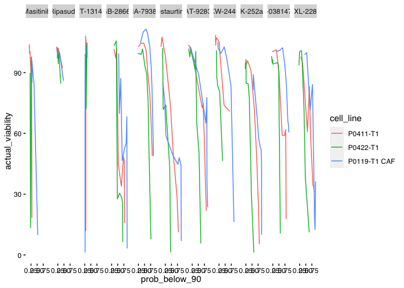
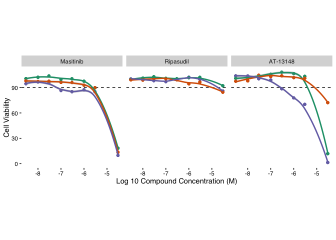
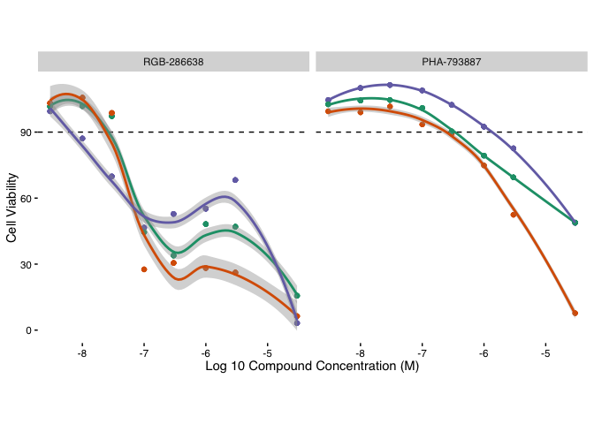
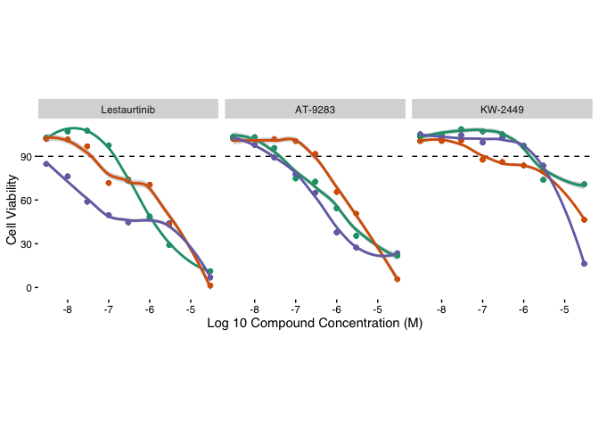
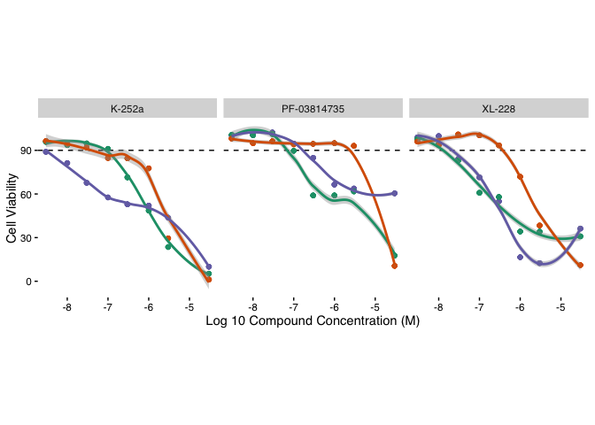
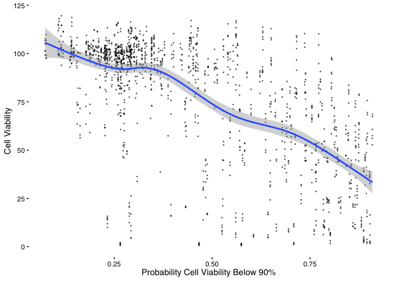
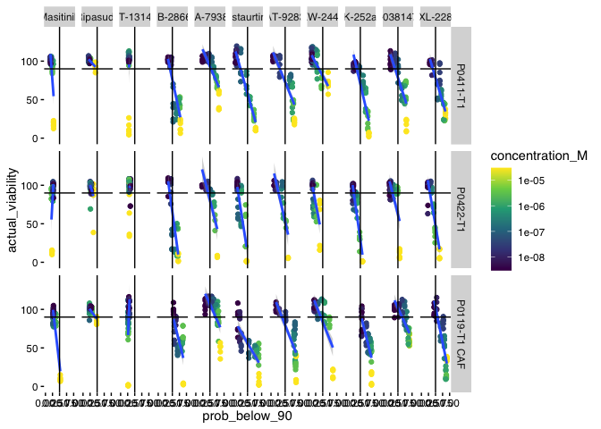

Assess Viability Screen Results
================
Matthew Berginski
2023-11-14

``` r
compound_order = c("Masitinib","Ripasudil","AT-13148","RGB-286638","PHA-793887","Lestaurtinib","AT-9283","KW-2449", "K-252a","PF-03814735","XL-228")

low_effect_drugs <- c("Masitinib","Ripasudil","AT-13148")
high_effect_drugs <- c("RGB-286638","PHA-793887")
conc_diff_drugs <- c("Lestaurtinib","AT-9283","KW-2449")
diff_cell_drugs <-c("K-252a","PF-03814735","XL-228")

testing_results = bind_rows(
    read_rds(here('results/validation_results/validation_screen_part2.rds')),
    read_rds(here('results/validation_results/validation_screen_part3.rds'))
) %>% filter(compound %in% compound_order, ! qc_fail) 

klaeger_below90_model_predictions <- readRDS(here('results/klaeger_below90_model_predictions.rds'))
```

``` r
testing_results = testing_results %>%
    rename(drug = compound, actual_viability = viability) %>%
    #We won't need the DMSO samples for the
    filter(drug != "DMSO") %>%
    mutate(viability_90 = actual_viability < 90) %>%
    select(-lum) %>%
  mutate(cell_line = case_when(
        cell_line == "P0422" ~ "P0422-T1",
        cell_line == "P0411" ~ "P0411-T1",
        cell_line == "CAF" ~ "P0119-T1 CAF")) %>%
    identity()

testing_results = testing_results %>% 
    left_join(klaeger_below90_model_predictions) %>% 
    mutate(drug = fct_relevel(drug,compound_order))
```

    ## Joining with `by = join_by(drug, concentration_M, cell_line)`

``` r
temp = testing_results  %>%
    group_by(cell_line, concentration_M,drug) %>%
    mutate(actual_viability = mean(actual_viability),
                 prob_below_90 = mean(prob_below_90)) %>%
    mutate(drug = fct_relevel(drug,compound_order)) #%>%

temp$cell_line <- factor(temp$cell_line, levels = c("P0411-T1","P0422-T1","P0119-T1 CAF"))
ggplot(temp, aes(x=prob_below_90,y=actual_viability, color=cell_line)) + 
    geom_line() +
    facet_wrap(~drug, nrow = 1) +
    BerginskiRMisc::theme_berginski()
```

<!-- -->

``` r
ggsave(here('figures/validation_testing/pred_vs_actual.png'),width=18*0.6,height=5.9*0.6)
BerginskiRMisc::trimImage(here('figures/validation_testing/pred_vs_actual.png'))
```

``` r
ggplot(temp %>% filter(drug %in% low_effect_drugs), 
             aes(x=log10(concentration_M), y=actual_viability, color=cell_line)) +
    geom_hline(aes(yintercept = 90), linetype = 2) +
    geom_point() +
    geom_smooth() +
    facet_wrap(~drug,nrow=1) + 
    labs(x="Log 10 Compound Concentration (M)",y="Cell Viability") +
    BerginskiRMisc::theme_berginski() +
    theme(aspect.ratio = 1, legend.position = "none") +
    scale_color_brewer(type = "qual", palette = "Dark2") 
```

    ## `geom_smooth()` using method = 'loess' and formula = 'y ~ x'

<!-- -->

``` r
ggsave(here('figures/validation_testing/low_pred.png'), height=3)
```

    ## Saving 7 x 3 in image
    ## `geom_smooth()` using method = 'loess' and formula = 'y ~ x'

``` r
BerginskiRMisc::trimImage(here('figures/validation_testing/low_pred.png'))

ggplot(temp %>% filter(drug %in% high_effect_drugs), 
             aes(x=log10(concentration_M), y=actual_viability, color=cell_line)) +
    geom_hline(aes(yintercept = 90), linetype = 2) +
    geom_point() +
    geom_smooth() +
    facet_wrap(~drug,nrow=1) + 
    labs(x="Log 10 Compound Concentration (M)",y="Cell Viability") +
    BerginskiRMisc::theme_berginski() +
    theme(aspect.ratio = 1, legend.position = "none") +
    scale_color_brewer(type = "qual", palette = "Dark2") 
```

    ## `geom_smooth()` using method = 'loess' and formula = 'y ~ x'

<!-- -->

``` r
ggsave(here('figures/validation_testing/deadly_pred.png'), height=3)
```

    ## Saving 7 x 3 in image
    ## `geom_smooth()` using method = 'loess' and formula = 'y ~ x'

``` r
BerginskiRMisc::trimImage(here('figures/validation_testing/deadly_pred.png'))

ggplot(temp %>% filter(drug %in% conc_diff_drugs), 
             aes(x=log10(concentration_M), y=actual_viability, color=cell_line)) +
    geom_hline(aes(yintercept = 90), linetype = 2) +
    geom_point() +
    geom_smooth() +
    facet_wrap(~drug,nrow=1) + 
    labs(x="Log 10 Compound Concentration (M)",y="Cell Viability") +
    BerginskiRMisc::theme_berginski() +
    theme(aspect.ratio = 1, legend.position = "none") +
    scale_color_brewer(type = "qual", palette = "Dark2") 
```

    ## `geom_smooth()` using method = 'loess' and formula = 'y ~ x'

<!-- -->

``` r
ggsave(here('figures/validation_testing/high_diff_pred.png'), height=3)
```

    ## Saving 7 x 3 in image
    ## `geom_smooth()` using method = 'loess' and formula = 'y ~ x'

``` r
BerginskiRMisc::trimImage(here('figures/validation_testing/high_diff_pred.png'))

ggplot(temp %>% filter(drug %in% diff_cell_drugs), 
             aes(x=log10(concentration_M), y=actual_viability, color=cell_line)) +
    geom_hline(aes(yintercept = 90), linetype = 2) +
    geom_point() +
    geom_smooth() +
    facet_wrap(~drug,nrow=1) + 
    labs(x="Log 10 Compound Concentration (M)",y="Cell Viability") +
    BerginskiRMisc::theme_berginski() +
    theme(aspect.ratio = 1, legend.position = "none") +
    scale_color_brewer(type = "qual", palette = "Dark2") 
```

    ## `geom_smooth()` using method = 'loess' and formula = 'y ~ x'

<!-- -->

``` r
ggsave(here('figures/validation_testing/high_cell_diff_pred.png'), height=3)
```

    ## Saving 7 x 3 in image
    ## `geom_smooth()` using method = 'loess' and formula = 'y ~ x'

``` r
BerginskiRMisc::trimImage(here('figures/validation_testing/high_cell_diff_pred.png'))
```

``` r
get_ROC = function(these_results) {
    if (all(these_results$viability_90) | all(! these_results$viability_90)) {
        return(NA)
    }
    pred <- prediction(these_results$prob_below_90,these_results$viability_90)
    perf_roc <- performance(pred, measure = "auc")
    return(perf_roc@y.values[[1]])
}

get_ROC_plot_data = function(these_results,cell_line,drug) {
    if (all(these_results$viability_90) | all(! these_results$viability_90)) {
        return(NA)
    }
    pred <- prediction(these_results$prob_below_90,these_results$viability_90)
    perf <- performance(pred,measure = "tpr",x.measure = "fpr")
    return(data.frame(fpr = perf@x.values[[1]],
                                        tpr = perf@y.values[[1]],
                                        cell_line = cell_line,
                                        drug = drug))
}

get_AUPRC = function(these_results) {
    if (all(these_results$viability_90) | all(! these_results$viability_90)) {
        return(NA)
    }
    pred <- prediction(these_results$prob_below_90,these_results$viability_90)
    prc_roc <- performance(pred, measure = "aucpr")
    return(prc_roc@y.values[[1]])
}

get_AUPRC_plot_data = function(these_results,cell_line,drug) {
    if (all(these_results$viability_90) | all(! these_results$viability_90)) {
        return(NA)
    }
    pred <- prediction(these_results$prob_below_90,these_results$viability_90)
    perf <- performance(pred,measure = "prec",x.measure = "rec")
    
    sorted_prediction_data = these_results %>% arrange(desc(prob_below_90))
    
    precision_vals = perf@y.values[[1]]
    precision_vals[1] = if_else(sorted_prediction_data$viability_90[1],1,0)
    recall_vals = perf@x.values[[1]]
    return(data.frame(precision = precision_vals,
                                        recall = recall_vals,
                                        cell_line = cell_line,
                                        drug = drug))
}

model_assessments = testing_results %>%
    group_by(cell_line, drug) %>%
    nest() %>%
    mutate(cor_val = map_dbl(data, ~tidy(cor.test(.x$actual_viability, .x$prob_below_90))$estimate)) %>%
    mutate(cor_conf_low = map_dbl(data, ~tidy(cor.test(.x$actual_viability, .x$prob_below_90))$conf.low)) %>%
    mutate(cor_conf_high = map_dbl(data, ~tidy(cor.test(.x$actual_viability, .x$prob_below_90))$conf.high)) %>%
    mutate(cor_p_val = map_dbl(data, ~tidy(cor.test(.x$actual_viability, .x$prob_below_90))$p.value)) %>%
    mutate(cor_p_val_adj = p.adjust(cor_p_val)) %>%
    mutate(ROC = map_dbl(data, get_ROC)) %>%
    mutate(ROC_plot_data = pmap(list(data,cell_line,drug), get_ROC_plot_data)) %>%
    mutate(PRC = map_dbl(data, get_AUPRC)) %>%
    mutate(PRC_plot_data = pmap(list(data,cell_line,drug), get_AUPRC_plot_data)) %>%
    mutate(percent_pos = map_dbl(data, ~mean(.x$viability_90))) %>%
    ungroup() %>%
    mutate(drug = fct_relevel(drug,compound_order)) %>%
    identity()
```

``` r
ggplot(testing_results, aes(x=prob_below_90,y=actual_viability)) + 
    geom_point(size=0.25,alpha=0.5) + 
    geom_smooth() +
    labs(x="Probability Cell Viability Below 90%", y="Cell Viability") +
    BerginskiRMisc::theme_berginski()
```

    ## `geom_smooth()` using method = 'gam' and formula = 'y ~ s(x, bs = "cs")'

<!-- -->

``` r
ggsave(here('figures/validation_testing/global_pred_vs_actual.png'), height=3.3,width=3.3)
```

    ## `geom_smooth()` using method = 'gam' and formula = 'y ~ s(x, bs = "cs")'

``` r
BerginskiRMisc::trimImage(here('figures/validation_testing/global_pred_vs_actual.png'))
```

``` r
global_ROC_score = get_ROC(testing_results)
global_ROC = get_ROC_plot_data(testing_results,"all","all")

ROC_text = data.frame(
    x=1,y=0,ROC_text = paste0('Validation AUROC: ', signif(global_ROC_score,3)))

global_ROC_plot = ggplot(global_ROC, aes(x=fpr, y=tpr)) + 
    geom_abline(intercept = 0,slope = 1, alpha=0.5,linetype=2) +
    geom_line(alpha=0.75) +
    geom_text(mapping=aes(x=1,y=0,label=ROC_text),data=ROC_text,color='black',vjust="inward",hjust="inward") +
    labs(x="False Positive Rate",y="True Positive Rate") +
    BerginskiRMisc::theme_berginski()

global_AUPRC = get_AUPRC(testing_results)
global_PRC = get_AUPRC_plot_data(testing_results,"all","all")
global_percent_pos = mean(testing_results$viability_90)

PRC_text = data.frame(
    x=1,y=0,PRC_text = paste0('Validation AUPRC: ', signif(global_AUPRC,3)))

global_PRC_plots = ggplot(global_PRC, aes(x=recall,y=precision)) + 
    geom_hline(aes(yintercept = global_percent_pos), alpha=0.5, linetype=2) +
    geom_line(alpha=0.75) + 
    geom_text(mapping=aes(x=1,y=0,label=PRC_text),data=PRC_text,color='black',vjust="inward",hjust="inward") +
    xlim(c(0,1)) + ylim(c(0,1)) +
    labs(x="Recall",y="Precision") +
    BerginskiRMisc::theme_berginski()

global_plots = global_ROC_plot + global_PRC_plots
ggsave(here('figures/validation_testing/global_ROC_PRC.png'), height=3.3,width=6.6)
BerginskiRMisc::trimImage(here('figures/validation_testing/global_ROC_PRC.png'))
```

``` r
full_ROC_vals = reduce(model_assessments %>% filter(!is.na(ROC)) %>% pull(ROC_plot_data),bind_rows) %>%
#   mutate(cell_line = case_when(
#       cell_line == "P1004" ~ "P0422-T1",
#       cell_line == "P1304" ~ "P0411-T1",
#       cell_line == "CAF" ~ "P0119-T1 CAF")) %>% 
  mutate(drug = fct_relevel(drug,compound_order))%>%
  mutate(cell_line = fct_relevel(cell_line, c("P0411-T1", "P0422-T1","P0119-T1 CAF")))

ROC_plots = ggplot(full_ROC_vals, aes(x=fpr, y=tpr, color=cell_line)) + 
    geom_abline(intercept = 0,slope = 1, alpha=0.5,linetype=2) +
    geom_line(alpha=0.75) + 
    # geom_text(mapping=aes(x=1,y=0,label=text),data=ROC_text,color='black',vjust="inward",hjust="inward",size=3.5) +
    # geom_segment(x=0,y=0,xend=1,yend=1) +
    xlim(c(0,1)) + ylim(c(0,1)) +
    labs(x="False Positive Rate",y="True Positive Rate", color="Cell Line") +
    BerginskiRMisc::theme_berginski() +
    theme(axis.text.x = element_text(angle = 90,vjust=0.5)) +
    scale_color_brewer(type = "qual", palette = "Dark2") +
    facet_wrap(~drug, nrow = 1)

full_AUPRC_vals = reduce(model_assessments %>% filter(!is.na(ROC)) %>% pull(PRC_plot_data),bind_rows) %>%
#   mutate(cell_line = case_when(
#       cell_line == "P1004" ~ "P0422-T1",
#       cell_line == "P1304" ~ "P0411-T1",
#       cell_line == "CAF" ~ "P0119-T1 CAF")) %>% 
  mutate(drug = fct_relevel(drug,compound_order)) 

full_AUPRC_vals$cell_line <- factor(full_AUPRC_vals$cell_line, levels = c("P0411-T1","P0422-T1","P0119-T1 CAF"))
model_assessments$cell_line <- factor(model_assessments$cell_line, levels = c("P0411-T1","P0422-T1","P0119-T1 CAF"))

PRC_plots = ggplot(full_AUPRC_vals, aes(x=recall,y=precision,color=cell_line)) + 
    geom_hline(data=model_assessments, mapping = aes(yintercept = percent_pos, color=cell_line), alpha=0.5, linetype=2) +
    geom_line(alpha=0.75) + 
    # geom_text(mapping=aes(x=1,y=0,label=text),data=ROC_text,color='black',vjust="inward",hjust="inward",size=3.5) +
    # geom_segment(x=0,y=0,xend=1,yend=1) +
    xlim(c(0,1)) + ylim(c(0,1)) +
    labs(x="Recall",y="Precision",color="Cell Line") +
    BerginskiRMisc::theme_berginski() +
    theme(axis.text.x = element_text(angle = 90,vjust=0.5)) +
    scale_color_brewer(type = "qual", palette = "Dark2") +
    facet_wrap(~drug, nrow = 1)

dir.create(here('figures/validation_testing/'))
```

    ## Warning in dir.create(here("figures/validation_testing/")):
    ## '/Users/madisonjenner/Library/Mobile
    ## Documents/com~apple~CloudDocs/Documents/GitHub/PDACperturbations/figures/validation_testing'
    ## already exists

``` r
full_assess = ROC_plots / PRC_plots
# ggsave(here('figures/validation_testing/validation_ROC_PRC.png'),width=18*0.5,height=15*0.5)

ggsave(here('figures/validation_testing/validation_ROC_PRC.png'),width=18*0.6,height=5.9*0.6)
BerginskiRMisc::trimImage(here('figures/validation_testing/validation_ROC_PRC.png'))
```

``` r
ggplot(testing_results, aes(x=prob_below_90, y = actual_viability, color = concentration_M)) +
    scale_x_log10() +
    scale_color_viridis_c(trans = "log10") +
    geom_jitter() +
    geom_smooth(method = "lm") +
    geom_hline(aes(yintercept = 90)) +
    geom_vline(aes(xintercept = 0.5)) +
    BerginskiRMisc::theme_berginski() +
    xlim(c(0,1)) +
    facet_grid(rows = vars(fct_relevel(cell_line,"P0411-T1","P0422-T1","P0119-T1 CAF")), cols = vars(drug))
```

    ## Scale for x is already present.
    ## Adding another scale for x, which will replace the existing scale.
    ## `geom_smooth()` using formula = 'y ~ x'

    ## Warning: The following aesthetics were dropped during statistical transformation: colour
    ## ℹ This can happen when ggplot fails to infer the correct grouping structure in
    ##   the data.
    ## ℹ Did you forget to specify a `group` aesthetic or to convert a numerical
    ##   variable into a factor?
    ## The following aesthetics were dropped during statistical transformation: colour
    ## ℹ This can happen when ggplot fails to infer the correct grouping structure in
    ##   the data.
    ## ℹ Did you forget to specify a `group` aesthetic or to convert a numerical
    ##   variable into a factor?
    ## The following aesthetics were dropped during statistical transformation: colour
    ## ℹ This can happen when ggplot fails to infer the correct grouping structure in
    ##   the data.
    ## ℹ Did you forget to specify a `group` aesthetic or to convert a numerical
    ##   variable into a factor?
    ## The following aesthetics were dropped during statistical transformation: colour
    ## ℹ This can happen when ggplot fails to infer the correct grouping structure in
    ##   the data.
    ## ℹ Did you forget to specify a `group` aesthetic or to convert a numerical
    ##   variable into a factor?
    ## The following aesthetics were dropped during statistical transformation: colour
    ## ℹ This can happen when ggplot fails to infer the correct grouping structure in
    ##   the data.
    ## ℹ Did you forget to specify a `group` aesthetic or to convert a numerical
    ##   variable into a factor?
    ## The following aesthetics were dropped during statistical transformation: colour
    ## ℹ This can happen when ggplot fails to infer the correct grouping structure in
    ##   the data.
    ## ℹ Did you forget to specify a `group` aesthetic or to convert a numerical
    ##   variable into a factor?
    ## The following aesthetics were dropped during statistical transformation: colour
    ## ℹ This can happen when ggplot fails to infer the correct grouping structure in
    ##   the data.
    ## ℹ Did you forget to specify a `group` aesthetic or to convert a numerical
    ##   variable into a factor?
    ## The following aesthetics were dropped during statistical transformation: colour
    ## ℹ This can happen when ggplot fails to infer the correct grouping structure in
    ##   the data.
    ## ℹ Did you forget to specify a `group` aesthetic or to convert a numerical
    ##   variable into a factor?
    ## The following aesthetics were dropped during statistical transformation: colour
    ## ℹ This can happen when ggplot fails to infer the correct grouping structure in
    ##   the data.
    ## ℹ Did you forget to specify a `group` aesthetic or to convert a numerical
    ##   variable into a factor?
    ## The following aesthetics were dropped during statistical transformation: colour
    ## ℹ This can happen when ggplot fails to infer the correct grouping structure in
    ##   the data.
    ## ℹ Did you forget to specify a `group` aesthetic or to convert a numerical
    ##   variable into a factor?
    ## The following aesthetics were dropped during statistical transformation: colour
    ## ℹ This can happen when ggplot fails to infer the correct grouping structure in
    ##   the data.
    ## ℹ Did you forget to specify a `group` aesthetic or to convert a numerical
    ##   variable into a factor?
    ## The following aesthetics were dropped during statistical transformation: colour
    ## ℹ This can happen when ggplot fails to infer the correct grouping structure in
    ##   the data.
    ## ℹ Did you forget to specify a `group` aesthetic or to convert a numerical
    ##   variable into a factor?
    ## The following aesthetics were dropped during statistical transformation: colour
    ## ℹ This can happen when ggplot fails to infer the correct grouping structure in
    ##   the data.
    ## ℹ Did you forget to specify a `group` aesthetic or to convert a numerical
    ##   variable into a factor?
    ## The following aesthetics were dropped during statistical transformation: colour
    ## ℹ This can happen when ggplot fails to infer the correct grouping structure in
    ##   the data.
    ## ℹ Did you forget to specify a `group` aesthetic or to convert a numerical
    ##   variable into a factor?
    ## The following aesthetics were dropped during statistical transformation: colour
    ## ℹ This can happen when ggplot fails to infer the correct grouping structure in
    ##   the data.
    ## ℹ Did you forget to specify a `group` aesthetic or to convert a numerical
    ##   variable into a factor?
    ## The following aesthetics were dropped during statistical transformation: colour
    ## ℹ This can happen when ggplot fails to infer the correct grouping structure in
    ##   the data.
    ## ℹ Did you forget to specify a `group` aesthetic or to convert a numerical
    ##   variable into a factor?
    ## The following aesthetics were dropped during statistical transformation: colour
    ## ℹ This can happen when ggplot fails to infer the correct grouping structure in
    ##   the data.
    ## ℹ Did you forget to specify a `group` aesthetic or to convert a numerical
    ##   variable into a factor?
    ## The following aesthetics were dropped during statistical transformation: colour
    ## ℹ This can happen when ggplot fails to infer the correct grouping structure in
    ##   the data.
    ## ℹ Did you forget to specify a `group` aesthetic or to convert a numerical
    ##   variable into a factor?
    ## The following aesthetics were dropped during statistical transformation: colour
    ## ℹ This can happen when ggplot fails to infer the correct grouping structure in
    ##   the data.
    ## ℹ Did you forget to specify a `group` aesthetic or to convert a numerical
    ##   variable into a factor?
    ## The following aesthetics were dropped during statistical transformation: colour
    ## ℹ This can happen when ggplot fails to infer the correct grouping structure in
    ##   the data.
    ## ℹ Did you forget to specify a `group` aesthetic or to convert a numerical
    ##   variable into a factor?
    ## The following aesthetics were dropped during statistical transformation: colour
    ## ℹ This can happen when ggplot fails to infer the correct grouping structure in
    ##   the data.
    ## ℹ Did you forget to specify a `group` aesthetic or to convert a numerical
    ##   variable into a factor?
    ## The following aesthetics were dropped during statistical transformation: colour
    ## ℹ This can happen when ggplot fails to infer the correct grouping structure in
    ##   the data.
    ## ℹ Did you forget to specify a `group` aesthetic or to convert a numerical
    ##   variable into a factor?
    ## The following aesthetics were dropped during statistical transformation: colour
    ## ℹ This can happen when ggplot fails to infer the correct grouping structure in
    ##   the data.
    ## ℹ Did you forget to specify a `group` aesthetic or to convert a numerical
    ##   variable into a factor?
    ## The following aesthetics were dropped during statistical transformation: colour
    ## ℹ This can happen when ggplot fails to infer the correct grouping structure in
    ##   the data.
    ## ℹ Did you forget to specify a `group` aesthetic or to convert a numerical
    ##   variable into a factor?
    ## The following aesthetics were dropped during statistical transformation: colour
    ## ℹ This can happen when ggplot fails to infer the correct grouping structure in
    ##   the data.
    ## ℹ Did you forget to specify a `group` aesthetic or to convert a numerical
    ##   variable into a factor?
    ## The following aesthetics were dropped during statistical transformation: colour
    ## ℹ This can happen when ggplot fails to infer the correct grouping structure in
    ##   the data.
    ## ℹ Did you forget to specify a `group` aesthetic or to convert a numerical
    ##   variable into a factor?
    ## The following aesthetics were dropped during statistical transformation: colour
    ## ℹ This can happen when ggplot fails to infer the correct grouping structure in
    ##   the data.
    ## ℹ Did you forget to specify a `group` aesthetic or to convert a numerical
    ##   variable into a factor?
    ## The following aesthetics were dropped during statistical transformation: colour
    ## ℹ This can happen when ggplot fails to infer the correct grouping structure in
    ##   the data.
    ## ℹ Did you forget to specify a `group` aesthetic or to convert a numerical
    ##   variable into a factor?
    ## The following aesthetics were dropped during statistical transformation: colour
    ## ℹ This can happen when ggplot fails to infer the correct grouping structure in
    ##   the data.
    ## ℹ Did you forget to specify a `group` aesthetic or to convert a numerical
    ##   variable into a factor?
    ## The following aesthetics were dropped during statistical transformation: colour
    ## ℹ This can happen when ggplot fails to infer the correct grouping structure in
    ##   the data.
    ## ℹ Did you forget to specify a `group` aesthetic or to convert a numerical
    ##   variable into a factor?
    ## The following aesthetics were dropped during statistical transformation: colour
    ## ℹ This can happen when ggplot fails to infer the correct grouping structure in
    ##   the data.
    ## ℹ Did you forget to specify a `group` aesthetic or to convert a numerical
    ##   variable into a factor?
    ## The following aesthetics were dropped during statistical transformation: colour
    ## ℹ This can happen when ggplot fails to infer the correct grouping structure in
    ##   the data.
    ## ℹ Did you forget to specify a `group` aesthetic or to convert a numerical
    ##   variable into a factor?
    ## The following aesthetics were dropped during statistical transformation: colour
    ## ℹ This can happen when ggplot fails to infer the correct grouping structure in
    ##   the data.
    ## ℹ Did you forget to specify a `group` aesthetic or to convert a numerical
    ##   variable into a factor?

<!-- -->

``` r
ggsave(here('figures/validation_testing/validation_via_vs_predicted.png'),width=18*0.75,height=5*0.75)
```

    ## `geom_smooth()` using formula = 'y ~ x'

    ## Warning: The following aesthetics were dropped during statistical transformation: colour
    ## ℹ This can happen when ggplot fails to infer the correct grouping structure in
    ##   the data.
    ## ℹ Did you forget to specify a `group` aesthetic or to convert a numerical
    ##   variable into a factor?
    ## The following aesthetics were dropped during statistical transformation: colour
    ## ℹ This can happen when ggplot fails to infer the correct grouping structure in
    ##   the data.
    ## ℹ Did you forget to specify a `group` aesthetic or to convert a numerical
    ##   variable into a factor?
    ## The following aesthetics were dropped during statistical transformation: colour
    ## ℹ This can happen when ggplot fails to infer the correct grouping structure in
    ##   the data.
    ## ℹ Did you forget to specify a `group` aesthetic or to convert a numerical
    ##   variable into a factor?
    ## The following aesthetics were dropped during statistical transformation: colour
    ## ℹ This can happen when ggplot fails to infer the correct grouping structure in
    ##   the data.
    ## ℹ Did you forget to specify a `group` aesthetic or to convert a numerical
    ##   variable into a factor?
    ## The following aesthetics were dropped during statistical transformation: colour
    ## ℹ This can happen when ggplot fails to infer the correct grouping structure in
    ##   the data.
    ## ℹ Did you forget to specify a `group` aesthetic or to convert a numerical
    ##   variable into a factor?
    ## The following aesthetics were dropped during statistical transformation: colour
    ## ℹ This can happen when ggplot fails to infer the correct grouping structure in
    ##   the data.
    ## ℹ Did you forget to specify a `group` aesthetic or to convert a numerical
    ##   variable into a factor?
    ## The following aesthetics were dropped during statistical transformation: colour
    ## ℹ This can happen when ggplot fails to infer the correct grouping structure in
    ##   the data.
    ## ℹ Did you forget to specify a `group` aesthetic or to convert a numerical
    ##   variable into a factor?
    ## The following aesthetics were dropped during statistical transformation: colour
    ## ℹ This can happen when ggplot fails to infer the correct grouping structure in
    ##   the data.
    ## ℹ Did you forget to specify a `group` aesthetic or to convert a numerical
    ##   variable into a factor?
    ## The following aesthetics were dropped during statistical transformation: colour
    ## ℹ This can happen when ggplot fails to infer the correct grouping structure in
    ##   the data.
    ## ℹ Did you forget to specify a `group` aesthetic or to convert a numerical
    ##   variable into a factor?
    ## The following aesthetics were dropped during statistical transformation: colour
    ## ℹ This can happen when ggplot fails to infer the correct grouping structure in
    ##   the data.
    ## ℹ Did you forget to specify a `group` aesthetic or to convert a numerical
    ##   variable into a factor?
    ## The following aesthetics were dropped during statistical transformation: colour
    ## ℹ This can happen when ggplot fails to infer the correct grouping structure in
    ##   the data.
    ## ℹ Did you forget to specify a `group` aesthetic or to convert a numerical
    ##   variable into a factor?
    ## The following aesthetics were dropped during statistical transformation: colour
    ## ℹ This can happen when ggplot fails to infer the correct grouping structure in
    ##   the data.
    ## ℹ Did you forget to specify a `group` aesthetic or to convert a numerical
    ##   variable into a factor?
    ## The following aesthetics were dropped during statistical transformation: colour
    ## ℹ This can happen when ggplot fails to infer the correct grouping structure in
    ##   the data.
    ## ℹ Did you forget to specify a `group` aesthetic or to convert a numerical
    ##   variable into a factor?
    ## The following aesthetics were dropped during statistical transformation: colour
    ## ℹ This can happen when ggplot fails to infer the correct grouping structure in
    ##   the data.
    ## ℹ Did you forget to specify a `group` aesthetic or to convert a numerical
    ##   variable into a factor?
    ## The following aesthetics were dropped during statistical transformation: colour
    ## ℹ This can happen when ggplot fails to infer the correct grouping structure in
    ##   the data.
    ## ℹ Did you forget to specify a `group` aesthetic or to convert a numerical
    ##   variable into a factor?
    ## The following aesthetics were dropped during statistical transformation: colour
    ## ℹ This can happen when ggplot fails to infer the correct grouping structure in
    ##   the data.
    ## ℹ Did you forget to specify a `group` aesthetic or to convert a numerical
    ##   variable into a factor?
    ## The following aesthetics were dropped during statistical transformation: colour
    ## ℹ This can happen when ggplot fails to infer the correct grouping structure in
    ##   the data.
    ## ℹ Did you forget to specify a `group` aesthetic or to convert a numerical
    ##   variable into a factor?
    ## The following aesthetics were dropped during statistical transformation: colour
    ## ℹ This can happen when ggplot fails to infer the correct grouping structure in
    ##   the data.
    ## ℹ Did you forget to specify a `group` aesthetic or to convert a numerical
    ##   variable into a factor?
    ## The following aesthetics were dropped during statistical transformation: colour
    ## ℹ This can happen when ggplot fails to infer the correct grouping structure in
    ##   the data.
    ## ℹ Did you forget to specify a `group` aesthetic or to convert a numerical
    ##   variable into a factor?
    ## The following aesthetics were dropped during statistical transformation: colour
    ## ℹ This can happen when ggplot fails to infer the correct grouping structure in
    ##   the data.
    ## ℹ Did you forget to specify a `group` aesthetic or to convert a numerical
    ##   variable into a factor?
    ## The following aesthetics were dropped during statistical transformation: colour
    ## ℹ This can happen when ggplot fails to infer the correct grouping structure in
    ##   the data.
    ## ℹ Did you forget to specify a `group` aesthetic or to convert a numerical
    ##   variable into a factor?
    ## The following aesthetics were dropped during statistical transformation: colour
    ## ℹ This can happen when ggplot fails to infer the correct grouping structure in
    ##   the data.
    ## ℹ Did you forget to specify a `group` aesthetic or to convert a numerical
    ##   variable into a factor?
    ## The following aesthetics were dropped during statistical transformation: colour
    ## ℹ This can happen when ggplot fails to infer the correct grouping structure in
    ##   the data.
    ## ℹ Did you forget to specify a `group` aesthetic or to convert a numerical
    ##   variable into a factor?
    ## The following aesthetics were dropped during statistical transformation: colour
    ## ℹ This can happen when ggplot fails to infer the correct grouping structure in
    ##   the data.
    ## ℹ Did you forget to specify a `group` aesthetic or to convert a numerical
    ##   variable into a factor?
    ## The following aesthetics were dropped during statistical transformation: colour
    ## ℹ This can happen when ggplot fails to infer the correct grouping structure in
    ##   the data.
    ## ℹ Did you forget to specify a `group` aesthetic or to convert a numerical
    ##   variable into a factor?
    ## The following aesthetics were dropped during statistical transformation: colour
    ## ℹ This can happen when ggplot fails to infer the correct grouping structure in
    ##   the data.
    ## ℹ Did you forget to specify a `group` aesthetic or to convert a numerical
    ##   variable into a factor?
    ## The following aesthetics were dropped during statistical transformation: colour
    ## ℹ This can happen when ggplot fails to infer the correct grouping structure in
    ##   the data.
    ## ℹ Did you forget to specify a `group` aesthetic or to convert a numerical
    ##   variable into a factor?
    ## The following aesthetics were dropped during statistical transformation: colour
    ## ℹ This can happen when ggplot fails to infer the correct grouping structure in
    ##   the data.
    ## ℹ Did you forget to specify a `group` aesthetic or to convert a numerical
    ##   variable into a factor?
    ## The following aesthetics were dropped during statistical transformation: colour
    ## ℹ This can happen when ggplot fails to infer the correct grouping structure in
    ##   the data.
    ## ℹ Did you forget to specify a `group` aesthetic or to convert a numerical
    ##   variable into a factor?
    ## The following aesthetics were dropped during statistical transformation: colour
    ## ℹ This can happen when ggplot fails to infer the correct grouping structure in
    ##   the data.
    ## ℹ Did you forget to specify a `group` aesthetic or to convert a numerical
    ##   variable into a factor?
    ## The following aesthetics were dropped during statistical transformation: colour
    ## ℹ This can happen when ggplot fails to infer the correct grouping structure in
    ##   the data.
    ## ℹ Did you forget to specify a `group` aesthetic or to convert a numerical
    ##   variable into a factor?
    ## The following aesthetics were dropped during statistical transformation: colour
    ## ℹ This can happen when ggplot fails to infer the correct grouping structure in
    ##   the data.
    ## ℹ Did you forget to specify a `group` aesthetic or to convert a numerical
    ##   variable into a factor?
    ## The following aesthetics were dropped during statistical transformation: colour
    ## ℹ This can happen when ggplot fails to infer the correct grouping structure in
    ##   the data.
    ## ℹ Did you forget to specify a `group` aesthetic or to convert a numerical
    ##   variable into a factor?

``` r
BerginskiRMisc::trimImage(here('figures/validation_testing/validation_via_vs_predicted.png'))
```
