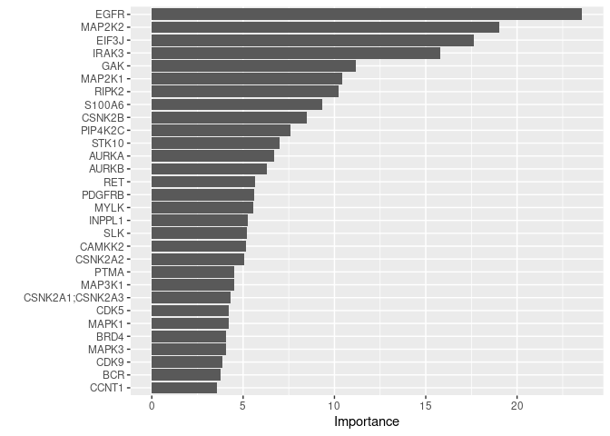

Build Klaeger PDAC Synergy Model - Random Forest
================
Matthew Berginski

# Read In and Combine Klaeger/Synergy Data

``` r
klaeger_data = read_rds(here('data/klaeger_full_tidy.rds'))

klaeger_data_wide = klaeger_data %>%
    pivot_wider(names_from = gene_name, values_from = relative_intensity)
```

# Modeling

## Random Forest - Below 90 Predictions - Leave One Compound Out

<!-- -->

<!-- -->

## Random Forest - Below 90 Predictions - Leave One Compound/Concentration Out

<!-- -->

<!-- -->

## Random Forest - Below 90 Models - Variable Importance Models/Plots

``` r
binary_90_models[["CAF"]] %>% 
    pluck(".workflow", 1) %>%
    pull_workflow_fit() %>%
    vip(num_features = 30)
```

<!-- -->

``` r
binary_90_models[["NAF"]] %>% 
    pluck(".workflow", 1) %>%
    pull_workflow_fit() %>%
    vip(num_features = 30)
```

<!-- -->

``` r
binary_90_models[["P1004"]] %>% 
    pluck(".workflow", 1) %>%
    pull_workflow_fit() %>%
    vip(num_features = 30)
```

<!-- -->

``` r
binary_90_models[["P1304"]] %>% 
    pluck(".workflow", 1) %>%
    pull_workflow_fit() %>%
    vip(num_features = 30)
```

<!-- -->

## Random Forest - Below 40 Predictions - Leave One Compound Out

``` r
klaeger_data_matches_full = klaeger_data_matches_full %>%
    mutate(viability_binary = as.factor(viability < 40))
```

<!-- -->

### Same Plot as above but no NAF line

<!-- -->

## Random Forest - Below 40 Predictions - Leave One Compound/Concentration Out

``` r
tic()

if (file.exists(here('src/klaeger_synergy_binary_model/predictions_LOO_concen_below40.rds'))) {
    prediction_results_LOO_concen = read_rds(here('src/klaeger_synergy_binary_model/predictions_LOO_concen_below40.rds'))
} else {
    prediction_results_LOO_concen = c()
    for (this_cell_line in unique(klaeger_data_matches_full$cell_line)) {
        
        klaeger_data_cell_line = klaeger_data_matches_full %>%
            filter(cell_line == this_cell_line)
        
        for (exclude_compound in unique(klaeger_data_cell_line$drug)) {
            for (exclude_concentration in unique(klaeger_data_cell_line$concentration_M)) {
                
                klaeger_train = klaeger_data_cell_line %>%
                    filter(drug != exclude_compound, concentration_M != exclude_concentration) %>%
                    select(-drug,-drug_lower,-pdac,-concentration_M,-cell_line,-viability) 
                
                klaeger_test = klaeger_data_cell_line %>%
                    filter(drug == exclude_compound, concentration_M == exclude_concentration) %>%
                    select(-drug,-drug_lower,-pdac,-concentration_M,-cell_line,-viability,-viability_binary)
                
                these_prediction_results = klaeger_data_cell_line %>%
                    filter(drug == exclude_compound, concentration_M == exclude_concentration) %>%
                    select(drug,drug_lower,pdac,concentration_M,cell_line,viability,viability_binary) %>%
                    rename(actual_viability_binary = viability_binary, actual_viability = viability)
                
                rf_mod <-
                    rand_forest(trees = 1000) %>%
                    set_engine("ranger", num.threads = 12) %>%
                    set_mode("classification")
                
                rf_fit_rs <-
                    rf_mod %>%
                    fit(viability_binary ~ ., data = klaeger_train)
                
                these_prediction_results$predicted_viability =predict(rf_fit_rs, klaeger_test, type = "prob")$.pred_TRUE
                these_prediction_results$test_set_size = dim(klaeger_test)[1]
                
                prediction_results_LOO_concen = bind_rows(
                    prediction_results_LOO_concen,
                    these_prediction_results
                )
            }
        }
        write_rds(prediction_results_LOO_concen,here('src/klaeger_synergy_binary_model/predictions_LOO_concen_below40.rds'))
    }
}
toc()
```

    ## 0.014 sec elapsed

``` r
ROC_vals = bind_rows(
    gather_ROC_vals(prediction_results_LOO_concen %>% filter(cell_line == "CAF"), "CAF"),
    gather_ROC_vals(prediction_results_LOO_concen %>% filter(cell_line == "NAF"), "NAF"),
    gather_ROC_vals(prediction_results_LOO_concen %>% filter(cell_line == "P1004"), "P1004"),
    gather_ROC_vals(prediction_results_LOO_concen %>% filter(cell_line == "P1304"), "P1304"),
) %>% rename(cell_line = prediction_type) %>%
    arrange(cell_line,desc(cutoff))

ROC_measurements = ROC_vals %>% 
    group_by(cell_line) %>% 
    summarise("ROC_AUC" = signif(auc(x = 1 - FPR, y = TPR),3),
                        "PRC_AUC" = signif(auc(x = recall, y = precision),3)) %>%
    ungroup() %>%
    mutate("AUC_rank" = min_rank(ROC_AUC),
                 "PRC_rank" = min_rank(PRC_AUC),
                 "sum_rank" = AUC_rank + PRC_rank) %>%
    arrange(desc(sum_rank)) %>%
    select(-contains('rank'))
```

    ## Warning in regularize.values(x, y, ties, missing(ties), na.rm = na.rm):
    ## collapsing to unique 'x' values
    
    ## Warning in regularize.values(x, y, ties, missing(ties), na.rm = na.rm):
    ## collapsing to unique 'x' values
    
    ## Warning in regularize.values(x, y, ties, missing(ties), na.rm = na.rm):
    ## collapsing to unique 'x' values
    
    ## Warning in regularize.values(x, y, ties, missing(ties), na.rm = na.rm):
    ## collapsing to unique 'x' values

``` r
null_line = data.frame(x1 = 0, x2 = 1, y1 = 0, y2 = 1)

AUC_plot = ggplot(ROC_vals) + 
    geom_segment(data=null_line, mapping=aes(x=x1,y=y1,xend=x2,yend=y2),alpha=0.25) +
    # geom_point(aes(x=FPR,y=TPR, color=cell_line),lwd=1) + 
    geom_line(aes(x=FPR,y=TPR, color=cell_line),lwd=1) +
    labs(x="FPR",y="TPR") +
    theme(legend.position = "none") +
    ggtitle("Below 40 LOO Concentration") +
    BerginskiRMisc::theme_berginski()

null_line = data.frame(x1 = 0, x2 = 1, 
                                             y1 = mean(as.logical(klaeger_data_matches_full$viability_binary)), 
                                             y2 = mean(as.logical(klaeger_data_matches_full$viability_binary)))

PRC_plot = ggplot(ROC_vals) + 
    geom_segment(data=null_line, mapping=aes(x=x1,y=y1,xend=x2,yend=y2),alpha=0.25) +
    # geom_point(aes(x=FPR,y=TPR, color=cell_line),lwd=1) + 
    geom_line(aes(x=recall,y=precision, color=cell_line),lwd=1) +
    labs(x="Recall",y="Precision") +
    # xlim(c(0.075,0.25)) +
    BerginskiRMisc::theme_berginski()

ROC_table = tableGrob(ROC_measurements, row = rep("",dim(ROC_measurements)[1]))

full_plots = ggarrange(AUC_plot, PRC_plot, ROC_table,nrow=1)
full_plots
```

<!-- -->
