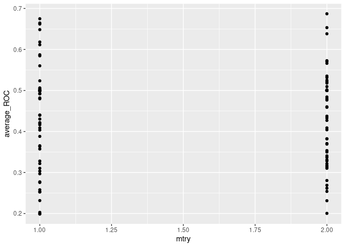
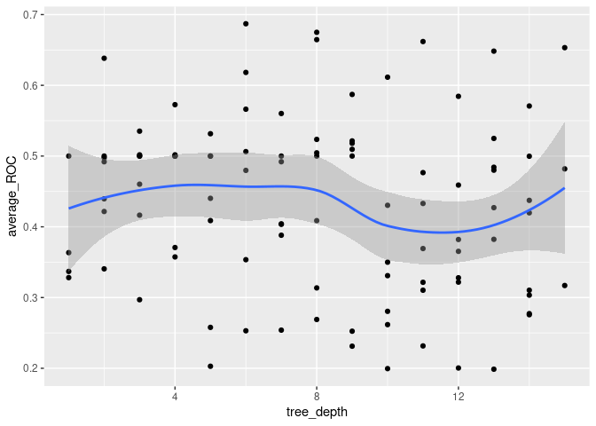

Klaeger/Synergy Binary Model Testing
================
Matthew Berginski
2021-06-08

# Read In Data Sets

``` r
cell_line_compound_splits = read_rds(here('results/klaeger_synergy_classification_90_CV_split.rds'))
```

# XGBoost Model Fitting

``` r
xgb_spec <- boost_tree(
    trees = tune(), 
    tree_depth = tune(),
    min_n = tune(), 
    loss_reduction = tune(),                     
    sample_size = tune(), 
    mtry = tune(),         
    learn_rate = tune(), ## step size
) %>% 
    set_engine("xgboost") %>% 
    set_mode("classification")

xgb_grid <- grid_latin_hypercube(
    trees(),
    tree_depth(),
    min_n(),
    loss_reduction(),
    sample_size = sample_prop(),
    finalize(mtry(), cell_line_compound_splits$CAF),
    learn_rate(),
    size = 100
)

xgb_wf <- workflow() %>%
    add_formula(viability_90 ~ .) %>%
    add_model(xgb_spec)
```

``` r
tic()

if (! file.exists(here('results/xgboost_below90_models/CAF.rds'))) {
    xgb_res_CAF <- tune_grid(
        xgb_wf,
        resamples = cell_line_compound_splits$CAF,
        grid = xgb_grid,
        control = control_grid(save_pred = TRUE)
    ) %>% write_rds(here('results/xgboost_below90_models/CAF.rds'), compress = 'gz')
}

if (! file.exists(here('results/xgboost_below90_models/P1004.rds'))) {
    xgb_res_P1004 <- tune_grid(
        xgb_wf,
        resamples = cell_line_compound_splits$P1004,
        grid = xgb_grid,
        control = control_grid(save_pred = TRUE)
    ) %>% write_rds(here('results/xgboost_below90_models/P1004.rds'), compress = 'gz')
}

if (! file.exists(here('results/xgboost_below90_models/P1004.rds'))) {
    xgb_res_P1304 <- tune_grid(
        xgb_wf,
        resamples = cell_line_compound_splits$P1304,
        grid = xgb_grid,
        control = control_grid(save_pred = TRUE)
    ) %>% write_rds(here('results/xgboost_below90_models/P1304.rds'), compress = 'gz')
}
toc()
```

    ## 0.004 sec elapsed

``` r
process_full_roc_data <- function(all_results, cell_line) {
    
    roc_vals = data.frame()
    for (model_id in unique(all_results$.config)) {
        these_results = all_results %>% filter(.config == model_id)
        pred <- prediction(these_results$.pred_TRUE,these_results$viability_90)
        perf_roc <- performance(pred, measure = "auc")
        prc_roc <- performance(pred, measure = "aucpr")
        
        roc_vals = bind_rows(
            roc_vals,
            data.frame(model_id = model_id,roc = perf_roc@y.values[[1]],prc = prc_roc@y.values[[1]] )
        )
    }
    roc_vals = roc_vals %>%
        mutate(roc_rank = dense_rank(desc(roc)),
                     prc_rank = dense_rank(desc(prc))) %>%
        rename_with(~paste0(.x,"_",cell_line), .cols=!model_id)
}

get_ROC_curve_values <- function(results, cell_line) {
    pred <- prediction(results$.pred_TRUE,results$viability_90)
    perf <- performance(pred,measure = "tpr",x.measure = "fpr")
    return(data.frame(tpr = perf@x.values[[1]],
                                        fpr = perf@y.values[[1]],
                                        cell_line = cell_line))
}

get_PRC_curve_values <- function(results, cell_line) {
    pred <- prediction(results$.pred_TRUE,results$viability_90)
    perf <- performance(pred,measure = "prec",x.measure = "rec")
    return(data.frame(precision = perf@y.values[[1]],
                                        recall = perf@x.values[[1]],
                                        cell_line = cell_line))
}
```

``` r
xgb_res_CAF = read_rds(here('results/xgboost_below90_models/CAF.rds'))
xgb_res_P1004 = read_rds(here('results/xgboost_below90_models/P1004.rds'))
xgb_res_P1304 = read_rds(here('results/xgboost_below90_models/P1304.rds'))

xgboost_results = process_full_roc_data(xgb_res_CAF %>% collect_predictions(), "CAF") %>%
    left_join(process_full_roc_data(xgb_res_P1004 %>% collect_predictions(), "P1004")) %>%
    left_join(process_full_roc_data(xgb_res_P1304 %>% collect_predictions(), "P1304")) %>%
    mutate(average_ROC = (roc_CAF + roc_P1004 + roc_P1304)/3,
                 average_PRC = (prc_CAF + prc_P1004 + prc_P1304)/3) %>%
    arrange(desc(average_ROC)) %>%
    left_join(xgb_res_CAF %>% 
                            collect_metrics() %>% 
                            filter(.metric == "roc_auc") %>%
                            select(mtry,trees,tree_depth,learn_rate,loss_reduction,sample_size,.config),
                        by = c('model_id' = '.config'))
```

    ## Joining, by = "model_id"
    ## Joining, by = "model_id"

``` r
best_ROC_vals_xgboost = bind_rows(
    xgb_res_CAF %>% 
        collect_predictions() %>% 
        filter(.config == xgboost_results$model_id[1]) %>%
        get_ROC_curve_values("CAF"),
    xgb_res_P1004 %>% 
        collect_predictions() %>% 
        filter(.config == xgboost_results$model_id[1]) %>%
        get_ROC_curve_values("P1004"),
    xgb_res_P1304 %>% 
        collect_predictions() %>% 
        filter(.config == xgboost_results$model_id[1]) %>%
        get_ROC_curve_values("P1304"),
)

best_PRC_vals_xgboost = bind_rows(
    xgb_res_CAF %>% 
        collect_predictions() %>% 
        filter(.config == xgboost_results$model_id[1]) %>%
        get_PRC_curve_values("CAF"),
    xgb_res_P1004 %>% 
        collect_predictions() %>% 
        filter(.config == xgboost_results$model_id[1]) %>%
        get_PRC_curve_values("P1004"),
    xgb_res_P1304 %>% 
        collect_predictions() %>% 
        filter(.config == xgboost_results$model_id[1]) %>%
        get_PRC_curve_values("P1304"),
)
```

``` r
ggplot(xgboost_results, aes(x=mtry,y=average_ROC)) + geom_point()
```

<!-- -->

``` r
ggplot(xgboost_results, aes(x=tree_depth,y=average_ROC)) + geom_point() + geom_smooth()
```

    ## `geom_smooth()` using method = 'loess' and formula 'y ~ x'

<!-- -->

# Random Forest Model Fitting

``` r
rand_forest_spec <- rand_forest(
    trees = tune(), 
    mtry = tune(),
    min_n = tune()
) %>% set_engine("ranger") %>% 
    set_mode("classification")

rand_forest_grid <- grid_latin_hypercube(
    trees(c(1000,5000)),
    min_n(),
    finalize(mtry(),cell_line_compound_splits$CAF),
    size = 100
)

rand_forest_wf <- workflow() %>%
    add_formula(viability_90 ~ .) %>%
    add_model(rand_forest_spec)
```

``` r
tic()
if (! file.exists(here('results/rand_forest_below90_models/CAF.rds'))) {
    rand_forest_res_CAF <- tune_grid(
        rand_forest_wf,
        resamples = cell_line_compound_splits$CAF,
        grid = rand_forest_grid,
        control = control_grid(save_pred = TRUE)
    ) %>% write_rds(here('results/rand_forest_below90_models/CAF.rds'), compress = 'gz')
}

if (! file.exists(here('results/rand_forest_below90_models/P1004.rds'))) {
    rand_forest_res_P1004 <- tune_grid(
        rand_forest_wf,
        resamples = cell_line_compound_splits$P1004,
        grid = rand_forest_grid,
        control = control_grid(save_pred = TRUE)
    ) %>% write_rds(here('results/rand_forest_below90_models/P1004.rds'), compress = 'gz')
}

if (! file.exists(here('results/rand_forest_below90_models/P1304.rds'))) {
    rand_forest_res_P1304 <- tune_grid(
        rand_forest_wf,
        resamples = cell_line_compound_splits$P1304,
        grid = rand_forest_grid,
        control = control_grid(save_pred = TRUE)
    ) %>% write_rds(here('results/rand_forest_below90_models/P1304.rds'), compress = 'gz')
}
toc()
```

    ## 0.003 sec elapsed

``` r
rand_forest_res_CAF = read_rds(here('results/rand_forest_below90_models/CAF.rds'))
rand_forest_res_P1004 = read_rds(here('results/rand_forest_below90_models/P1004.rds'))
rand_forest_res_P1304 = read_rds(here('results/rand_forest_below90_models/P1304.rds'))

rand_forest_results = process_full_roc_data(rand_forest_res_CAF %>% collect_predictions(), "CAF") %>%
    left_join(process_full_roc_data(rand_forest_res_P1004 %>% collect_predictions(), "P1004")) %>%
    left_join(process_full_roc_data(rand_forest_res_P1304 %>% collect_predictions(), "P1304")) %>%
    mutate(average_ROC = (roc_CAF + roc_P1004 + roc_P1304)/3,
                 average_PRC = (prc_CAF + prc_P1004 + prc_P1304)/3) %>%
    arrange(desc(average_ROC))
```

    ## Joining, by = "model_id"
    ## Joining, by = "model_id"

``` r
best_ROC_vals_rand_forest = bind_rows(
    rand_forest_res_CAF %>% 
        collect_predictions() %>% 
        filter(.config == rand_forest_results$model_id[1]) %>%
        get_ROC_curve_values("CAF"),
    rand_forest_res_P1004 %>% 
        collect_predictions() %>% 
        filter(.config == rand_forest_results$model_id[1]) %>%
        get_ROC_curve_values("P1004"),
    rand_forest_res_P1304 %>% 
        collect_predictions() %>% 
        filter(.config == rand_forest_results$model_id[1]) %>%
        get_ROC_curve_values("P1304"),
)

best_PRC_vals_rand_forest = bind_rows(
    rand_forest_res_CAF %>% 
        collect_predictions() %>% 
        filter(.config == rand_forest_results$model_id[1]) %>%
        get_PRC_curve_values("CAF"),
    rand_forest_res_P1004 %>% 
        collect_predictions() %>% 
        filter(.config == rand_forest_results$model_id[1]) %>%
        get_PRC_curve_values("P1004"),
    rand_forest_res_P1304 %>% 
        collect_predictions() %>% 
        filter(.config == rand_forest_results$model_id[1]) %>%
        get_PRC_curve_values("P1304"),
)
```
