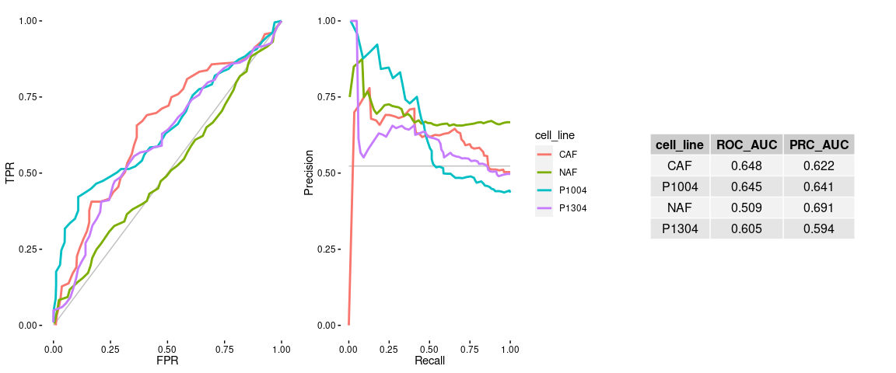
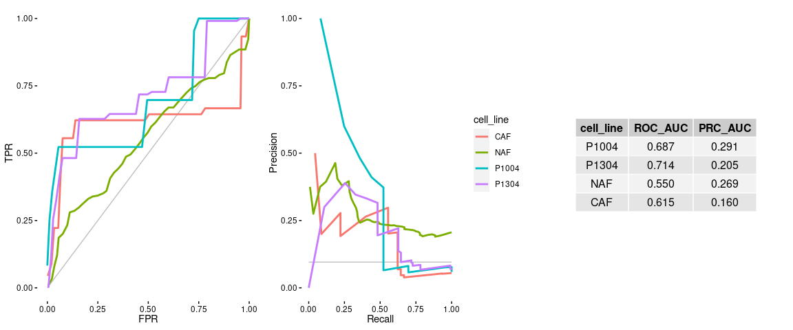
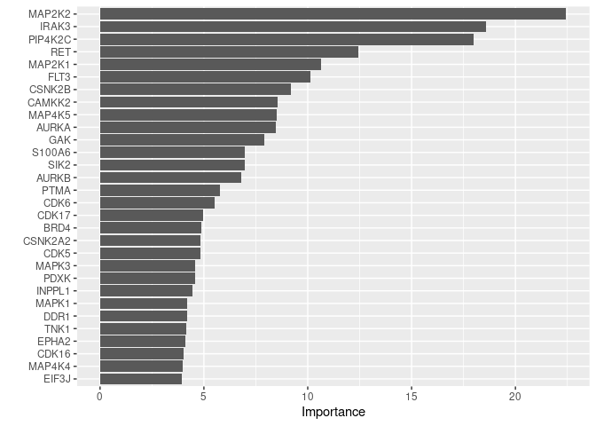
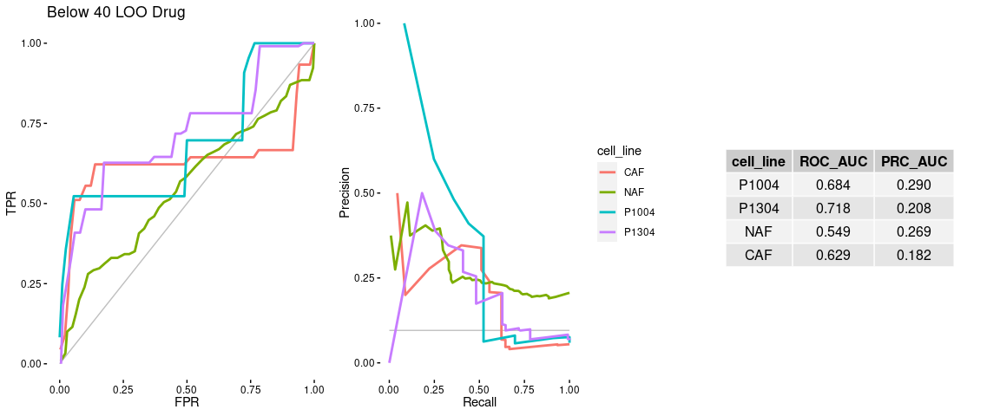
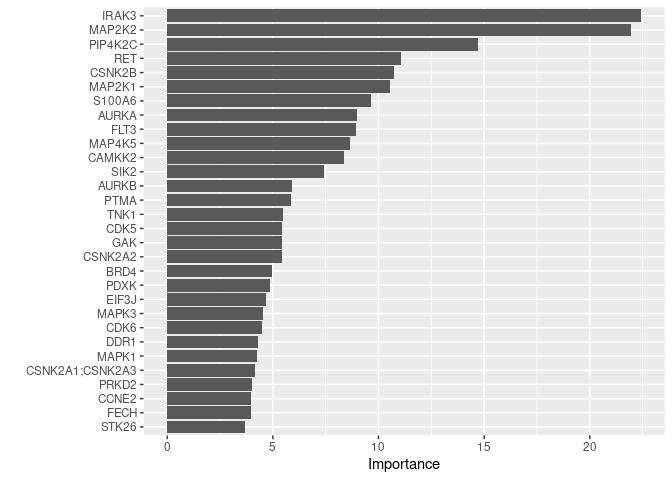
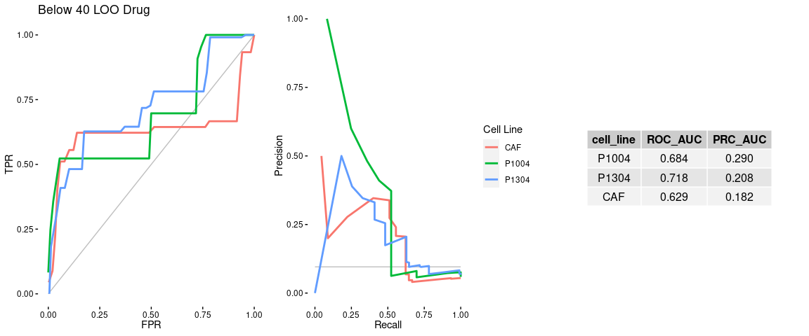
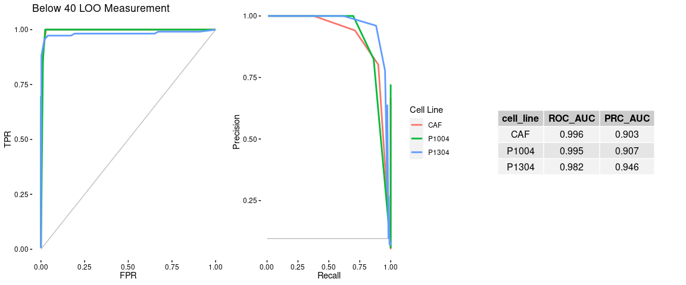

Build Klaeger PDAC Synergy Model - Random Forest
================
Matthew Berginski
2021-04-14

# Read In and Combine Klaeger/Synergy Data

This chunk of code reads in the pre-processed Klaeger kinase activation
data and the combined synergy screen data. These two data sets are
matched up and and then used in the rest of the model building steps.

# Modeling

The modeling results are divided into two parts, one model that attempts
to predict the likelihood that the cell viability is less than 90 and
another that tries to predict cell viability below 40. I picked below 90
and below 40 because the data is split in half at below 90 and 10% of
the data is below 40. Each cell line is modeled independently, but I’ve
combined the resulting ROC/PRC curves below. I’ve built models for cross
validation ROC/PRC curves for both sets of models with several different
cross validation stratifications:

  - Leave One Compound Out - all of a single compounds data (all
    concentrations) are left out for prediction
  - Leave One Compound Concentration Out - all of a given compound’s
    concentration values are left out for prediction (each given
    compound concentration was tested about 8 times in the data set)
  - Leave One Measurment Out - only a single measurement was excluded
    for prediction (this isn’t a very good test at all, given that there
    are \~8 repeats of the same experiment in the data, but I’ve
    included anyway for the sake of comparison)

## Random Forest - Below 90 Predictions - Leave One Compound Out

<!-- -->

<!-- -->

## Random Forest - Below 90 Predictions - Leave One Compound/Concentration Out

<!-- -->

<!-- -->

## Random Forest - Below 90 Predictions - Leave One Measurement Out

<!-- -->

<!-- -->

## Random Forest - Below 90 Models - Variable Importance Models/Plots

``` r
binary_90_models[["CAF"]] %>% 
    pluck(".workflow", 1) %>%
    pull_workflow_fit() %>%
    vip(num_features = 30)
```

<!-- -->

``` r
binary_90_models[["NAF"]] %>% 
    pluck(".workflow", 1) %>%
    pull_workflow_fit() %>%
    vip(num_features = 30)
```

<!-- -->

``` r
binary_90_models[["P1004"]] %>% 
    pluck(".workflow", 1) %>%
    pull_workflow_fit() %>%
    vip(num_features = 30)
```

<!-- -->

``` r
binary_90_models[["P1304"]] %>% 
    pluck(".workflow", 1) %>%
    pull_workflow_fit() %>%
    vip(num_features = 30)
```

<!-- -->

## Random Forest - Below 40 Predictions - Leave One Compound Out

``` r
klaeger_data_matches_full = klaeger_data_matches_full %>%
    mutate(viability_binary = as.factor(viability < 40))
```

<!-- -->

<!-- -->

## Random Forest - Below 40 Predictions - Leave One Compound/Concentration Out

<!-- -->

## Random Forest - Below 40 Predictions - Leave One Measurement Out

<!-- -->

<!-- -->
