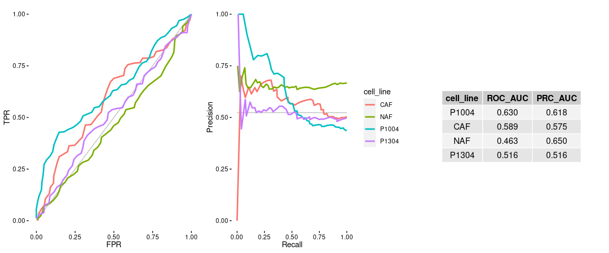
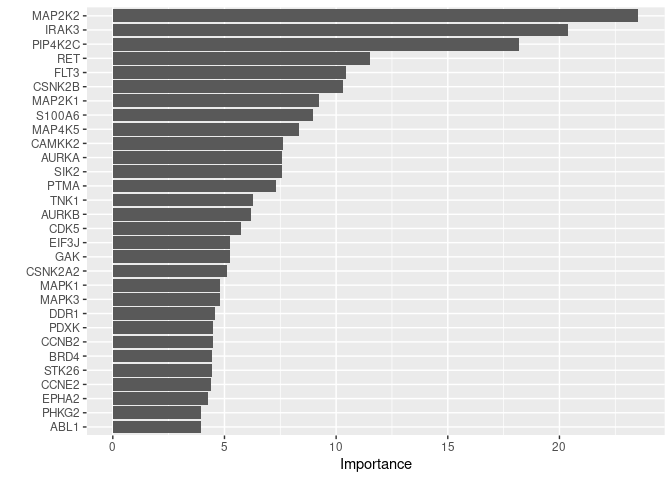
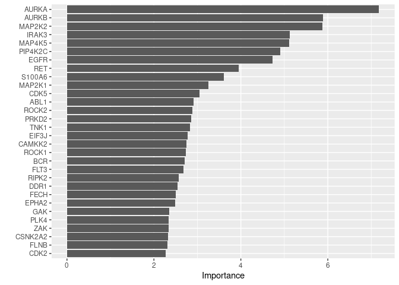
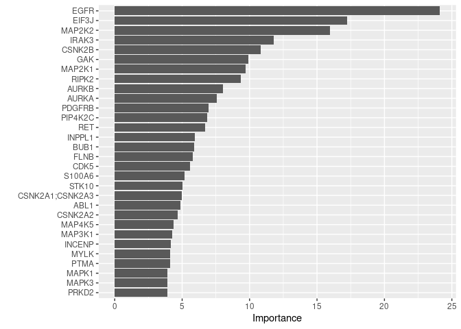
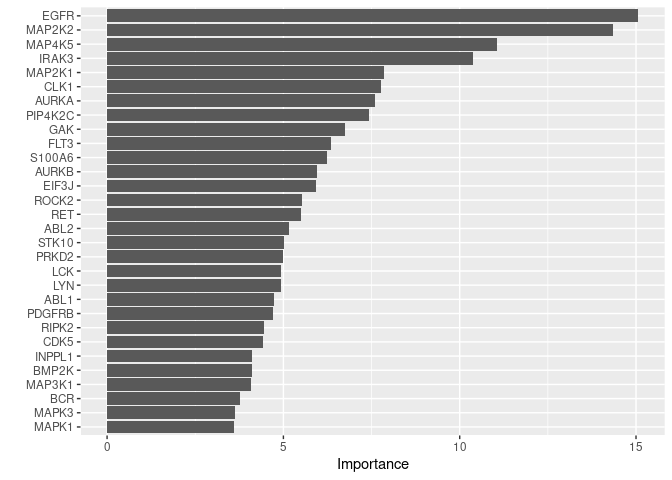
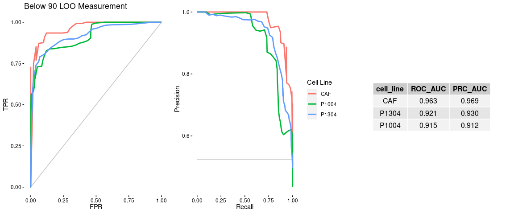
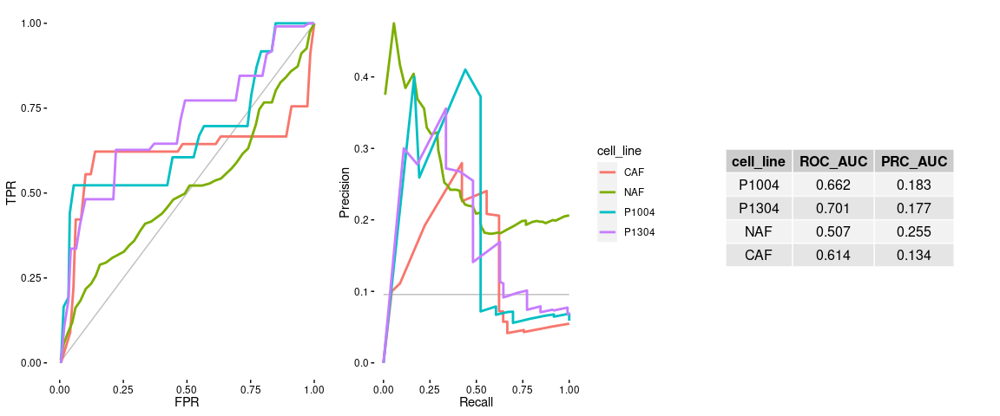

Build Klaeger PDAC Synergy Model - Random Forest
================
Matthew Berginski

# Read In and Combine Klaeger/Synergy Data

``` r
klaeger_data = read_rds(here('data/klaeger_full_tidy.rds'))

klaeger_data_wide = klaeger_data %>%
    pivot_wider(names_from = gene_name, values_from = relative_intensity)
```

``` r
synergy_data_only_single = read_rds(here('data/synergy_combined.rds')) %>%
    mutate(anchor_lower = tolower(anchor),
                 compound_lower = tolower(compound)) %>%
    filter(dose_anchor_m == 0 | dose_compound_m == 0)

compound_matches = read_csv(here('data/DrugMatches.csv')) %>%
    #removing one of the alisertib compound matches that aren't in my copy of the synergy
    filter(pdac != "mln8237")
```

    ## 
    ## ── Column specification ────────────────────────────────────────────────────────
    ## cols(
    ##   pdac = col_character(),
    ##   klaeger = col_character()
    ## )

``` r
klaeger_data_matches = klaeger_data_wide %>%
    #All of the Klaeger data with zero compound concentration are 1 across the
    #board, also I have no particular way to match up the the no-treatments with
    #all the no-treatments from the synergy screen.
    filter(concentration_M != 0) %>%
    mutate(drug_lower = tolower(drug)) %>%
    filter(drug_lower %in% compound_matches$klaeger) %>%
    left_join(compound_matches, by=c('drug_lower'='klaeger')) %>%
    select(drug,drug_lower,pdac,everything())

klaeger_data_matches_compound = klaeger_data_matches %>% 
    left_join(synergy_data_only_single %>% 
                            filter(dose_anchor_m == 0) %>%
                            select(compound_lower,dose_compound_m,viability,cell_line), 
                        by=c('pdac' = 'compound_lower', 'concentration_M' = 'dose_compound_m')) %>%
    select(drug,drug_lower,pdac,cell_line,viability,everything()) %>%
    filter(!is.na(viability))

klaeger_data_matches_anchor = klaeger_data_matches %>% 
    left_join(synergy_data_only_single %>% 
                            filter(dose_compound_m == 0) %>%
                            select(anchor_lower,dose_anchor_m,viability,cell_line), 
                        by=c('pdac' = 'anchor_lower', 'concentration_M' = 'dose_anchor_m')) %>%
    select(drug,drug_lower,pdac,cell_line,viability,everything()) %>%
    filter(!is.na(viability))

klaeger_data_matches_full = bind_rows(
    klaeger_data_matches_compound,
    klaeger_data_matches_anchor) %>% 
    mutate(viability_binary = as.factor(viability < 90)) %>%
    select(drug,drug_lower,pdac,cell_line,viability,viability_binary,everything())

klaeger_data_matches_tidy = klaeger_data %>% 
    filter(drug %in% unique(klaeger_data_matches_full$drug), 
                 concentration_M %in% unique(klaeger_data_matches_full$concentration_M))

no_gene_variation = klaeger_data_matches_tidy %>%
    group_by(gene_name) %>%
    summarise(gene_sd = sd(relative_intensity)) %>%
    filter(gene_sd == 0)

klaeger_data_matches_full = klaeger_data_matches_full %>%
    select(-one_of(no_gene_variation$gene_name))
```

# Modeling

## Random Forest - Below 90 Predictions - Leave One Compound Out

``` r
tic()

prediction_results = c()
for (this_cell_line in unique(klaeger_data_matches_full$cell_line)) {
    
    klaeger_data_cell_line = klaeger_data_matches_full %>%
        filter(cell_line == this_cell_line)
    
    for (exclude_compound in unique(klaeger_data_cell_line$drug)) {
        
        klaeger_train = klaeger_data_cell_line %>%
            filter(drug != exclude_compound) %>%
            select(-drug,-drug_lower,-pdac,-concentration_M,-cell_line,-viability) 
        
        klaeger_test = klaeger_data_cell_line %>%
            filter(drug == exclude_compound) %>%
            select(-drug,-drug_lower,-pdac,-concentration_M,-cell_line,-viability_binary,-viability)
        
        these_prediction_results = klaeger_data_cell_line %>%
            filter(drug == exclude_compound) %>%
            select(drug,drug_lower,pdac,concentration_M,cell_line,viability_binary,viability) %>%
            rename(actual_viability_binary = viability_binary, actual_viability = viability)
        
        rf_mod <-
            rand_forest(trees = 5000) %>%
            set_engine("ranger", num.threads = 12) %>%
            set_mode("classification")
        
        rf_fit_rs <-
            rf_mod %>%
            fit(viability_binary ~ ., data = klaeger_train)
        
        these_prediction_results$predicted_viability = predict(rf_fit_rs, klaeger_test, type = "prob")$.pred_TRUE
        these_prediction_results$test_set_size = dim(klaeger_test)[1]
        
        prediction_results = bind_rows(
            prediction_results,
            these_prediction_results
        )
    }
}
toc()
```

    ## 334.034 sec elapsed

``` r
# prediction_results = prediction_results %>% 
#   left_join(klaeger_data_matches_full %>% 
#                           select(drug,drug_lower,pdac,concentration_M,cell_line,viability))

# rf_fit = rf_mod %>%
#   fit(Growth ~ ., data = klaeger_data)
```

``` r
assess_threshold = function(threshold,data) {
    data %>% 
        mutate(actual_viability = as.logical(actual_viability_binary)) %>%
        mutate(above_thresh = predicted_viability >= threshold) %>% 
        summarise(cutoff = threshold,
                            TN = sum(! actual_viability & ! above_thresh),
                            FP = sum(! actual_viability & above_thresh),
                            FN = sum(actual_viability & ! above_thresh),
                            TP = sum(actual_viability & above_thresh))
}

gather_ROC_vals = function(input_data, prediction_type, sample_points = 50) {
    ROC_vals = quantile(input_data$predicted_viability,seq(0,1,length.out = sample_points)) %>%
        map(~ assess_threshold(., data=input_data)) %>%
        reduce(rbind) %>%
        mutate(TPR = TP/(TP+FN), 
                     FPR = FP/(FP+TN),
                     precision = TP/(TP+FP),
                     recall = TP/(TP+FN)) %>%
        mutate(prediction_type = prediction_type) %>%
        identity()
    return(ROC_vals)
}
```

``` r
ROC_vals = bind_rows(
    gather_ROC_vals(prediction_results %>% filter(cell_line == "CAF"), "CAF"),
    gather_ROC_vals(prediction_results %>% filter(cell_line == "NAF"), "NAF"),
    gather_ROC_vals(prediction_results %>% filter(cell_line == "P1004"), "P1004"),
    gather_ROC_vals(prediction_results %>% filter(cell_line == "P1304"), "P1304"),
) %>% rename(cell_line = prediction_type) %>%
    arrange(cell_line,desc(cutoff))

ROC_measurements = ROC_vals %>% 
    group_by(cell_line) %>% 
    summarise("ROC_AUC" = signif(auc(x = 1 - FPR, y = TPR),3),
                        "PRC_AUC" = signif(auc(x = recall, y = precision),3)) %>%
    ungroup() %>%
    mutate("AUC_rank" = min_rank(ROC_AUC),
                 "PRC_rank" = min_rank(PRC_AUC),
                 "sum_rank" = AUC_rank + PRC_rank) %>%
    arrange(desc(sum_rank)) %>%
    select(-contains('rank'))
```

    ## Warning in regularize.values(x, y, ties, missing(ties), na.rm = na.rm):
    ## collapsing to unique 'x' values
    
    ## Warning in regularize.values(x, y, ties, missing(ties), na.rm = na.rm):
    ## collapsing to unique 'x' values
    
    ## Warning in regularize.values(x, y, ties, missing(ties), na.rm = na.rm):
    ## collapsing to unique 'x' values

``` r
null_line = data.frame(x1 = 0, x2 = 1, y1 = 0, y2 = 1)

AUC_plot = ggplot(ROC_vals) + 
    geom_segment(data=null_line, mapping=aes(x=x1,y=y1,xend=x2,yend=y2),alpha=0.25) +
    # geom_point(aes(x=FPR,y=TPR, color=cell_line),lwd=1) + 
    geom_line(aes(x=FPR,y=TPR, color=cell_line),lwd=1) +
    labs(x="FPR",y="TPR") +
    theme(legend.position = "none") +
    BerginskiRMisc::theme_berginski()

null_line = data.frame(x1 = 0, x2 = 1, 
                                             y1 = mean(as.logical(klaeger_data_matches_full$viability_binary)), 
                                             y2 = mean(as.logical(klaeger_data_matches_full$viability_binary)))

PRC_plot = ggplot(ROC_vals) + 
    geom_segment(data=null_line, mapping=aes(x=x1,y=y1,xend=x2,yend=y2),alpha=0.25) +
    # geom_point(aes(x=FPR,y=TPR, color=cell_line),lwd=1) + 
    geom_line(aes(x=recall,y=precision, color=cell_line),lwd=1) +
    labs(x="Recall",y="Precision") +
    # xlim(c(0.075,0.25)) +
    BerginskiRMisc::theme_berginski()

ROC_table = tableGrob(ROC_measurements, row = rep("",dim(ROC_measurements)[1]))

full_plots = ggarrange(AUC_plot, PRC_plot, ROC_table,nrow=1)
full_plots
```

<!-- -->

## Random Forest - Below 90 Predictions - Leave One Compound/Concentration Out

``` r
tic()

if (file.exists(here('src/klaeger_synergy_binary_model/predictions_LOO_concen.rds'))) {
    prediction_results_LOO_concen = read_rds(here('src/klaeger_synergy_binary_model/predictions_LOO_concen.rds'))
} else {
    prediction_results_LOO_concen = c()
    for (this_cell_line in unique(klaeger_data_matches_full$cell_line)) {
        
        klaeger_data_cell_line = klaeger_data_matches_full %>%
            filter(cell_line == this_cell_line)
        
        for (exclude_compound in unique(klaeger_data_cell_line$drug)) {
            for (exclude_concentration in unique(klaeger_data_cell_line$concentration_M)) {
                
                klaeger_train = klaeger_data_cell_line %>%
                    filter(drug != exclude_compound, concentration_M != exclude_concentration) %>%
                    select(-drug,-drug_lower,-pdac,-concentration_M,-cell_line,-viability) 
                
                klaeger_test = klaeger_data_cell_line %>%
                    filter(drug == exclude_compound, concentration_M == exclude_concentration) %>%
                    select(-drug,-drug_lower,-pdac,-concentration_M,-cell_line,-viability_binary,-viability)
                
                these_prediction_results = klaeger_data_cell_line %>%
                    filter(drug == exclude_compound, concentration_M == exclude_concentration) %>%
                    select(drug,drug_lower,pdac,concentration_M,cell_line,viability,viability_binary) %>%
                    rename(actual_viability_binary = viability_binary, actual_viability = viability)
                
                rf_mod <-
                    rand_forest(trees = 5000) %>%
                    set_engine("ranger", num.threads = 12) %>%
                    set_mode("classification")
                
                rf_fit_rs <-
                    rf_mod %>%
                    fit(viability_binary ~ ., data = klaeger_train)
                
                these_prediction_results$predicted_viability =predict(rf_fit_rs, klaeger_test, type = "prob")$.pred_TRUE
                these_prediction_results$test_set_size = dim(klaeger_test)[1]
                
                prediction_results_LOO_concen = bind_rows(
                    prediction_results_LOO_concen,
                    these_prediction_results
                )
            }
        }
        write_rds(prediction_results_LOO_concen,here('src/klaeger_synergy_binary_model/predictions_LOO_concen.rds'))
    }
}
toc()
```

    ## 1286.861 sec elapsed

``` r
ROC_vals = bind_rows(
    gather_ROC_vals(prediction_results_LOO_concen %>% filter(cell_line == "CAF"), "CAF"),
    gather_ROC_vals(prediction_results_LOO_concen %>% filter(cell_line == "NAF"), "NAF"),
    gather_ROC_vals(prediction_results_LOO_concen %>% filter(cell_line == "P1004"), "P1004"),
    gather_ROC_vals(prediction_results_LOO_concen %>% filter(cell_line == "P1304"), "P1304"),
) %>% rename(cell_line = prediction_type) %>%
    arrange(cell_line,desc(cutoff))

ROC_measurements = ROC_vals %>% 
    group_by(cell_line) %>% 
    summarise("ROC_AUC" = signif(auc(x = 1 - FPR, y = TPR),3),
                        "PRC_AUC" = signif(auc(x = recall, y = precision),3)) %>%
    ungroup() %>%
    mutate("AUC_rank" = min_rank(ROC_AUC),
                 "PRC_rank" = min_rank(PRC_AUC),
                 "sum_rank" = AUC_rank + PRC_rank) %>%
    arrange(desc(sum_rank)) %>%
    select(-contains('rank'))
```

    ## Warning in regularize.values(x, y, ties, missing(ties), na.rm = na.rm):
    ## collapsing to unique 'x' values
    
    ## Warning in regularize.values(x, y, ties, missing(ties), na.rm = na.rm):
    ## collapsing to unique 'x' values
    
    ## Warning in regularize.values(x, y, ties, missing(ties), na.rm = na.rm):
    ## collapsing to unique 'x' values
    
    ## Warning in regularize.values(x, y, ties, missing(ties), na.rm = na.rm):
    ## collapsing to unique 'x' values

``` r
null_line = data.frame(x1 = 0, x2 = 1, y1 = 0, y2 = 1)

AUC_plot = ggplot(ROC_vals) + 
    geom_segment(data=null_line, mapping=aes(x=x1,y=y1,xend=x2,yend=y2),alpha=0.25) +
    # geom_point(aes(x=FPR,y=TPR, color=cell_line),lwd=1) + 
    geom_line(aes(x=FPR,y=TPR, color=cell_line),lwd=1) +
    labs(x="FPR",y="TPR") +
    theme(legend.position = "none") +
    BerginskiRMisc::theme_berginski()

null_line = data.frame(x1 = 0, x2 = 1, 
                                             y1 = mean(as.logical(klaeger_data_matches_full$viability_binary)), 
                                             y2 = mean(as.logical(klaeger_data_matches_full$viability_binary)))

PRC_plot = ggplot(ROC_vals) + 
    geom_segment(data=null_line, mapping=aes(x=x1,y=y1,xend=x2,yend=y2),alpha=0.25) +
    # geom_point(aes(x=FPR,y=TPR, color=cell_line),lwd=1) + 
    geom_line(aes(x=recall,y=precision, color=cell_line),lwd=1) +
    labs(x="Recall",y="Precision") +
    # xlim(c(0.075,0.25)) +
    BerginskiRMisc::theme_berginski()

ROC_table = tableGrob(ROC_measurements, row = rep("",dim(ROC_measurements)[1]))

full_plots = ggarrange(AUC_plot, PRC_plot, ROC_table,nrow=1)
full_plots
```

<!-- -->

## Random Forest - Below 90 Models - Variable Importance Models/Plots

``` r
tic()

binary_90_models = list()

prediction_results = c()
for (this_cell_line in unique(klaeger_data_matches_full$cell_line)) {
    
    klaeger_data_cell_line = klaeger_data_matches_full %>%
        filter(cell_line == this_cell_line) %>%
        select(-drug,-drug_lower,-pdac,-concentration_M,-cell_line,-viability) 
    
    splits <- initial_split(klaeger_data_cell_line)
    
    rf_mod <-
        rand_forest(trees = 1000) %>%
        set_engine("ranger", num.threads = 12, importance = "impurity") %>%
        set_mode("classification")
    
    # binary_90_models[[this_cell_line]] <-
    #   rf_mod %>%
    #   fit(viability_binary_90 ~ ., data = klaeger_data_cell_line)
    
    rf_recipe <- 
        recipe(viability_binary ~ ., data = klaeger_data_cell_line)
    
    rf_workflow <- 
        workflow() %>% 
        add_model(rf_mod) %>%
        add_recipe(rf_recipe)
    
    binary_90_models[[this_cell_line]] <-
        rf_workflow %>%
        last_fit(splits)
    
}
```

    ## 
    ## Attaching package: 'rlang'

    ## The following objects are masked from 'package:purrr':
    ## 
    ##     %@%, as_function, flatten, flatten_chr, flatten_dbl, flatten_int,
    ##     flatten_lgl, flatten_raw, invoke, list_along, modify, prepend,
    ##     splice

    ## 
    ## Attaching package: 'vctrs'

    ## The following object is masked from 'package:tibble':
    ## 
    ##     data_frame

    ## The following object is masked from 'package:dplyr':
    ## 
    ##     data_frame

``` r
toc()
```

    ## 2.905 sec elapsed

``` r
binary_90_models[["CAF"]] %>% 
    pluck(".workflow", 1) %>%
    pull_workflow_fit() %>%
    vip(num_features = 30)
```

<!-- -->

``` r
binary_90_models[["NAF"]] %>% 
    pluck(".workflow", 1) %>%
    pull_workflow_fit() %>%
    vip(num_features = 30)
```

<!-- -->

``` r
binary_90_models[["P1004"]] %>% 
    pluck(".workflow", 1) %>%
    pull_workflow_fit() %>%
    vip(num_features = 30)
```

<!-- -->

``` r
binary_90_models[["P1304"]] %>% 
    pluck(".workflow", 1) %>%
    pull_workflow_fit() %>%
    vip(num_features = 30)
```

<!-- -->

## Random Forest - Below 40 Predictions - Leave One Compound Out

``` r
klaeger_data_matches_full = klaeger_data_matches_full %>%
    mutate(viability_binary = as.factor(viability < 40))
```

``` r
tic()

prediction_results = c()
for (this_cell_line in unique(klaeger_data_matches_full$cell_line)) {
    
    klaeger_data_cell_line = klaeger_data_matches_full %>%
        filter(cell_line == this_cell_line)
    
    for (exclude_compound in unique(klaeger_data_cell_line$drug)) {
        
        klaeger_train = klaeger_data_cell_line %>%
            filter(drug != exclude_compound) %>%
            select(-drug,-drug_lower,-pdac,-concentration_M,-cell_line,-viability)
        
        klaeger_test = klaeger_data_cell_line %>%
            filter(drug == exclude_compound) %>%
            select(-drug,-drug_lower,-pdac,-concentration_M,-cell_line,-viability_binary,-viability)
        
        these_prediction_results = klaeger_data_cell_line %>%
            filter(drug == exclude_compound) %>%
            select(drug,drug_lower,pdac,concentration_M,cell_line,viability,viability_binary) %>%
            rename(actual_viability_binary = viability_binary, actual_viability = viability)
        
        rf_mod <-
            rand_forest(trees = 5000) %>%
            set_engine("ranger", num.threads = 12) %>%
            set_mode("classification")
        
        rf_fit_rs <-
            rf_mod %>%
            fit(viability_binary ~ ., data = klaeger_train)
        
        these_prediction_results$predicted_viability =predict(rf_fit_rs, klaeger_test, type = "prob")$.pred_TRUE
        these_prediction_results$test_set_size = dim(klaeger_test)[1]
        
        prediction_results = bind_rows(
            prediction_results,
            these_prediction_results
        )
    }
}
toc()
```

    ## 219.696 sec elapsed

``` r
# prediction_results = prediction_results %>% 
#   left_join(klaeger_data_matches_full %>% 
#                           select(drug,drug_lower,pdac,concentration_M,cell_line,viability))

# rf_fit = rf_mod %>%
#   fit(Growth ~ ., data = klaeger_data)
```

``` r
ROC_vals = bind_rows(
    gather_ROC_vals(prediction_results %>% filter(cell_line == "CAF"), "CAF"),
    gather_ROC_vals(prediction_results %>% filter(cell_line == "NAF"), "NAF"),
    gather_ROC_vals(prediction_results %>% filter(cell_line == "P1004"), "P1004"),
    gather_ROC_vals(prediction_results %>% filter(cell_line == "P1304"), "P1304"),
) %>% rename(cell_line = prediction_type) %>%
    arrange(cell_line,desc(cutoff))

ROC_measurements = ROC_vals %>% 
    group_by(cell_line) %>% 
    summarise("ROC_AUC" = signif(auc(x = 1 - FPR, y = TPR),3),
                        "PRC_AUC" = signif(auc(x = recall, y = precision),3)) %>%
    ungroup() %>%
    mutate("AUC_rank" = min_rank(ROC_AUC),
                 "PRC_rank" = min_rank(PRC_AUC),
                 "sum_rank" = AUC_rank + PRC_rank) %>%
    arrange(desc(sum_rank)) %>%
    select(-contains('rank'))
```

    ## Warning in regularize.values(x, y, ties, missing(ties), na.rm = na.rm):
    ## collapsing to unique 'x' values
    
    ## Warning in regularize.values(x, y, ties, missing(ties), na.rm = na.rm):
    ## collapsing to unique 'x' values
    
    ## Warning in regularize.values(x, y, ties, missing(ties), na.rm = na.rm):
    ## collapsing to unique 'x' values
    
    ## Warning in regularize.values(x, y, ties, missing(ties), na.rm = na.rm):
    ## collapsing to unique 'x' values

``` r
null_line = data.frame(x1 = 0, x2 = 1, y1 = 0, y2 = 1)

AUC_plot = ggplot(ROC_vals) + 
    geom_segment(data=null_line, mapping=aes(x=x1,y=y1,xend=x2,yend=y2),alpha=0.25) +
    # geom_point(aes(x=FPR,y=TPR, color=cell_line),lwd=1) + 
    geom_line(aes(x=FPR,y=TPR, color=cell_line),lwd=1) +
    labs(x="FPR",y="TPR") +
    theme(legend.position = "none") +
    BerginskiRMisc::theme_berginski()

null_line = data.frame(x1 = 0, x2 = 1, 
                                             y1 = mean(as.logical(klaeger_data_matches_full$viability_binary)), 
                                             y2 = mean(as.logical(klaeger_data_matches_full$viability_binary)))

PRC_plot = ggplot(ROC_vals) + 
    geom_segment(data=null_line, mapping=aes(x=x1,y=y1,xend=x2,yend=y2),alpha=0.25) +
    # geom_point(aes(x=FPR,y=TPR, color=cell_line),lwd=1) + 
    geom_line(aes(x=recall,y=precision, color=cell_line),lwd=1) +
    labs(x="Recall",y="Precision") +
    # xlim(c(0.075,0.25)) +
    BerginskiRMisc::theme_berginski()

ROC_table = tableGrob(ROC_measurements, row = rep("",dim(ROC_measurements)[1]))

full_plots = ggarrange(AUC_plot, PRC_plot, ROC_table,nrow=1)
full_plots
```

<!-- -->

## Random Forest - Below 40 Predictions - Leave One Compound/Concentration Out

``` r
tic()

if (file.exists(here('src/klaeger_synergy_binary_model/predictions_LOO_concen_below40.rds'))) {
    prediction_results_LOO_concen = read_rds(here('src/klaeger_synergy_binary_model/predictions_LOO_concen_below40.rds'))
} else {
    prediction_results_LOO_concen = c()
    for (this_cell_line in unique(klaeger_data_matches_full$cell_line)) {
        
        klaeger_data_cell_line = klaeger_data_matches_full %>%
            filter(cell_line == this_cell_line)
        
        for (exclude_compound in unique(klaeger_data_cell_line$drug)) {
            for (exclude_concentration in unique(klaeger_data_cell_line$concentration_M)) {
                
                klaeger_train = klaeger_data_cell_line %>%
                    filter(drug != exclude_compound, concentration_M != exclude_concentration) %>%
                    select(-drug,-drug_lower,-pdac,-concentration_M,-cell_line,-viability) 
                
                klaeger_test = klaeger_data_cell_line %>%
                    filter(drug == exclude_compound, concentration_M == exclude_concentration) %>%
                    select(-drug,-drug_lower,-pdac,-concentration_M,-cell_line,-viability,-viability_binary)
                
                these_prediction_results = klaeger_data_cell_line %>%
                    filter(drug == exclude_compound, concentration_M == exclude_concentration) %>%
                    select(drug,drug_lower,pdac,concentration_M,cell_line,viability,viability_binary) %>%
                    rename(actual_viability_binary = viability_binary, actual_viability = viability)
                
                rf_mod <-
                    rand_forest(trees = 1000) %>%
                    set_engine("ranger", num.threads = 12) %>%
                    set_mode("classification")
                
                rf_fit_rs <-
                    rf_mod %>%
                    fit(viability_binary ~ ., data = klaeger_train)
                
                these_prediction_results$predicted_viability =predict(rf_fit_rs, klaeger_test, type = "prob")$.pred_TRUE
                these_prediction_results$test_set_size = dim(klaeger_test)[1]
                
                prediction_results_LOO_concen = bind_rows(
                    prediction_results_LOO_concen,
                    these_prediction_results
                )
            }
        }
        write_rds(prediction_results_LOO_concen,here('src/klaeger_synergy_binary_model/predictions_LOO_concen_below40.rds'))
    }
}
toc()
```

    ## 326.492 sec elapsed

``` r
ROC_vals = bind_rows(
    gather_ROC_vals(prediction_results_LOO_concen %>% filter(cell_line == "CAF"), "CAF"),
    gather_ROC_vals(prediction_results_LOO_concen %>% filter(cell_line == "NAF"), "NAF"),
    gather_ROC_vals(prediction_results_LOO_concen %>% filter(cell_line == "P1004"), "P1004"),
    gather_ROC_vals(prediction_results_LOO_concen %>% filter(cell_line == "P1304"), "P1304"),
) %>% rename(cell_line = prediction_type) %>%
    arrange(cell_line,desc(cutoff))

ROC_measurements = ROC_vals %>% 
    group_by(cell_line) %>% 
    summarise("ROC_AUC" = signif(auc(x = 1 - FPR, y = TPR),3),
                        "PRC_AUC" = signif(auc(x = recall, y = precision),3)) %>%
    ungroup() %>%
    mutate("AUC_rank" = min_rank(ROC_AUC),
                 "PRC_rank" = min_rank(PRC_AUC),
                 "sum_rank" = AUC_rank + PRC_rank) %>%
    arrange(desc(sum_rank)) %>%
    select(-contains('rank'))
```

    ## Warning in regularize.values(x, y, ties, missing(ties), na.rm = na.rm):
    ## collapsing to unique 'x' values
    
    ## Warning in regularize.values(x, y, ties, missing(ties), na.rm = na.rm):
    ## collapsing to unique 'x' values
    
    ## Warning in regularize.values(x, y, ties, missing(ties), na.rm = na.rm):
    ## collapsing to unique 'x' values
    
    ## Warning in regularize.values(x, y, ties, missing(ties), na.rm = na.rm):
    ## collapsing to unique 'x' values

``` r
null_line = data.frame(x1 = 0, x2 = 1, y1 = 0, y2 = 1)

AUC_plot = ggplot(ROC_vals) + 
    geom_segment(data=null_line, mapping=aes(x=x1,y=y1,xend=x2,yend=y2),alpha=0.25) +
    # geom_point(aes(x=FPR,y=TPR, color=cell_line),lwd=1) + 
    geom_line(aes(x=FPR,y=TPR, color=cell_line),lwd=1) +
    labs(x="FPR",y="TPR") +
    theme(legend.position = "none") +
    BerginskiRMisc::theme_berginski()

null_line = data.frame(x1 = 0, x2 = 1, 
                                             y1 = mean(as.logical(klaeger_data_matches_full$viability_binary)), 
                                             y2 = mean(as.logical(klaeger_data_matches_full$viability_binary)))

PRC_plot = ggplot(ROC_vals) + 
    geom_segment(data=null_line, mapping=aes(x=x1,y=y1,xend=x2,yend=y2),alpha=0.25) +
    # geom_point(aes(x=FPR,y=TPR, color=cell_line),lwd=1) + 
    geom_line(aes(x=recall,y=precision, color=cell_line),lwd=1) +
    labs(x="Recall",y="Precision") +
    # xlim(c(0.075,0.25)) +
    BerginskiRMisc::theme_berginski()

ROC_table = tableGrob(ROC_measurements, row = rep("",dim(ROC_measurements)[1]))

full_plots = ggarrange(AUC_plot, PRC_plot, ROC_table,nrow=1)
full_plots
```

<!-- -->
