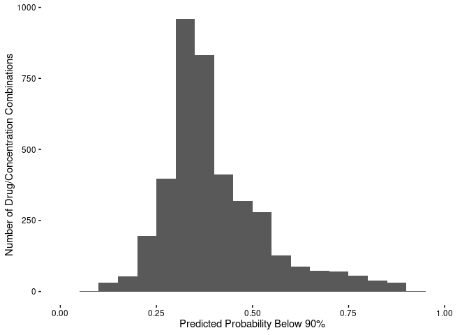

Klaeger Synergy Viability Binary Predictions
================
Matthew Berginski
2021-06-30

# Read In and Combine Klaeger/Synergy Data

``` r
klaeger_synergy_model_data = read_rds(here('results/klaeger_synergy_for_classification_90.rds')) %>%
    mutate(viability_90 = as.factor(viability_90))

klaeger_for_prediction = read_rds(here('results/klaeger_wide_for_prediction.rds'))
```

``` r
best_model_configs = read_rds(here('results/best_model_configs/rand_forest.rds'))
```

# Modeling

# Make Predictions Using Models

Now to use the models to make predictions on the remainder of the
compounds in the Klaeger data set and build a few plots showing the
distribution of viability predictions.

## Below 90% Cell Viability

<!-- -->

<!-- -->

``` r
CAF_importance = binary_90_models$CAF %>% 
    vip(num_features = 25)

CAF_DK = CAF_importance$data$Variable[CAF_importance$data$Variable %in% dark_kinases$symbol]

P1004_importance = binary_90_models$P1004 %>% 
    vip(num_features = 25)

P1004_DK = P1004_importance$data$Variable[P1004_importance$data$Variable %in% dark_kinases$symbol]

P1304_importance = binary_90_models$P1304 %>% 
    vip(num_features = 25)

P1304_DK = P1304_importance$data$Variable[P1304_importance$data$Variable %in% dark_kinases$symbol]

CAF_plot_data = as.data.frame(CAF_importance$data) %>% 
    mutate(Variable = fct_relevel(as.factor(Variable), rev(Variable)),
                 cell_line = "CAF")
P1004_plot_data = as.data.frame(P1004_importance$data) %>% 
    mutate(Variable = ifelse(Variable == "CSNK2A1;CSNK2A3","CSNK2A(1|3)",Variable)) %>%
    mutate(Variable = fct_relevel(as.factor(Variable), rev(Variable)),
                 cell_line = "P1004")

P1304_plot_data = as.data.frame(P1304_importance$data) %>% 
    mutate(Variable = fct_relevel(as.factor(Variable), rev(Variable)),
                 cell_line = "P1304")
```

``` r
CAF_plot = ggplot(CAF_plot_data, aes(y=Variable,x=Importance)) + 
    geom_col() +
    labs(x="Importance",y="Kinase Target",title = 'CAF Model') +
    BerginskiRMisc::theme_berginski()

P1004_plot = ggplot(P1004_plot_data, aes(y=Variable,x=Importance)) + 
    geom_col() +
    labs(x="Importance",y='',title = 'P1004 Model') +
    BerginskiRMisc::theme_berginski()

P1304_plot = ggplot(P1304_plot_data, aes(y=Variable,x=Importance)) + 
    geom_col() +
    labs(x="Importance",y="",title = 'P1304 Model') +
    BerginskiRMisc::theme_berginski()

VIP_upset = bind_rows(CAF_plot_data, P1004_plot_data, P1304_plot_data) %>%
    group_by(Variable) %>%
    summarise(cell_lines = list(cell_line)) %>%
    ggplot(aes(x=cell_lines)) + 
    geom_bar() + 
    scale_x_upset() +
    scale_y_continuous(breaks=seq(0,14,by=2)) +
    BerginskiRMisc::theme_berginski() +
    labs(x="Cell Lines",y="Number of Kinases")

full_importance_plot = CAF_plot + P1004_plot + P1304_plot
ggsave(here('figures/prediction_results/VIP_plot.png'),width=9,height=3.75)
BerginskiRMisc::trimImage(here('figures/prediction_results/VIP_plot.png'))

P1304_plot = ggplot(P1304_plot_data, aes(y=Variable,x=Importance)) + 
    geom_col() +
    labs(x="Importance",y="Kinase Target",title = 'P1304 Model') +
    BerginskiRMisc::theme_berginski()

VIP_with_upset = (CAF_plot + P1004_plot) / (P1304_plot + VIP_upset)
ggsave(here('figures/prediction_results/VIP_with_upset.png'),height=7.5,width=9)
BerginskiRMisc::trimImage(here('figures/prediction_results/VIP_with_upset.png'))
```

# Looking for Compounds to Test - Below 90 Predictions

With predictions of the likelihood that the compounds will push cell
viability below 90% or below 40%, the next step is to try to use these
predictions to pick out compound that are likely to have interesting
viability results. As for what interesting means, I’ve collected four
types of interesting results:

-   Compounds with Low Predicted Effect on Viability: Pick out the
    compounds that are predicted to have no/minimal effect on viability.
    This might seem to be the least interesting type of prediction at
    first, but a model is only as good as it’s ability to predict
    negative as well as positive results.
-   Compounds with High Predicted Effect on Viability: Pick out the
    compounds that are predicted to strongly decrease cell viability.
-   Compounds with Large Differences across Concentrations: Pick out
    compounds where the likelihood of affecting cell viability changes
    across the predicted concentrations. These should be compounds where
    low concentrations don’t affect cell viability, while high
    concentrations start to inhibit cell growth.
-   Compounds with Large Differences across Cell Lines: Pick out the
    compounds with large differences between the cell lines. This one
    seems kind of obvious as well, but if the model predicts large
    differences between the cell lines, this is probably worth testing

As for calculating all these, I’ve taken an approach that looks across
all the cell lines simultaneously. Searching for across the board low
effect and high effects is done by looking for the lowest and highest
average probability on a per compound basis. Searching for large
differences across concentrations is done by looking for the compounds
with the highest range between probabilities. The final criteria
(differences between cell lines) is a bit tougher to quantify, but what
I’ve done is:

-   matched up all the predictions across compound and concentration for
    each cell line
-   calculated the absolute value of all the combination of differences
    in probability value
-   We have three cell lines here (CAF, P1004 and P1304), so three
    combinations (CAF/P1004), (CAF/P1304) and (P1004/P1304)
-   find the compounds with the largest mean value across all
    differences

## Compounds with Low Predicted Effect

<!-- -->

## CAF Survival Max

<!-- -->

## Compounds with High Predicted Effect

<!-- -->

## Compounds with High Predicted Differences Across Concentrations

<!-- -->

## Compounds with High Predicted Differences Between Cell Lines

<!-- -->
