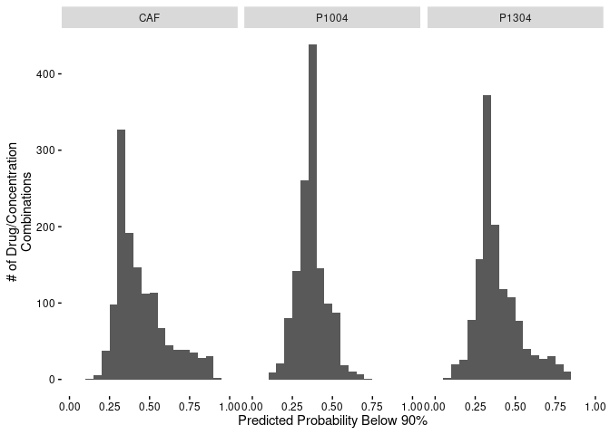

Make Klaeger Synergy Viability Predictions
================
Matthew Berginski
2021-04-13

# Read In and Combine Klaeger/Synergy Data

The first step for the prediction pipeline is the same as for the model
testing and production pipeline. Namely, read in the pre-processed
Klaeger data and then combine it with the appropriate synergy screen
results. Then, using this combined data set, build models for each of
the cell lines.

First a few facts about the compounds/concentrations used for the model
construction and predictions:

  - \# of Compounds Used for Model Construction: 40
  - \# of Compound/Concentration Combinations in Model Construction: 200
  - \# of Compounds in Prediction Set: 182
  - \# of Compound/Concentration Combinations in Prediction Set: 1456

Assuming we’d like to test all of the drugs (222 total) in combination
(24420 combinations) at 6 concentrations for each compound. The total
number of assays to run would be 879120, which would need 2290 384 well
plates per cell line.

# Modeling

## Random Forest - Below 90 Models

``` r
tic()

binary_90_models = list()

prediction_results = c()
for (this_cell_line in unique(klaeger_data_matches_full$cell_line)) {
    
    klaeger_data_cell_line = klaeger_data_matches_full %>%
        filter(cell_line == this_cell_line) %>%
        select(-drug,-drug_lower,-pdac,-concentration_M,-cell_line,-viability,-viability_binary_40) 
    
    rf_mod <-
        rand_forest(trees = 1000) %>%
        set_engine("ranger", num.threads = 12) %>%
        set_mode("classification")
    
    binary_90_models[[this_cell_line]] <-
        rf_mod %>%
        fit(viability_binary_90 ~ ., data = klaeger_data_cell_line)
}
toc()
```

    ## 2.212 sec elapsed

## Random Forest - Below 40 Models

``` r
tic()

binary_40_models = list()

prediction_results = c()
for (this_cell_line in unique(klaeger_data_matches_full$cell_line)) {
    
    klaeger_data_cell_line = klaeger_data_matches_full %>%
        filter(cell_line == this_cell_line) %>%
        select(-drug,-drug_lower,-pdac,-concentration_M,-cell_line,-viability,-viability_binary_90) 
    
    rf_mod <-
        rand_forest(trees = 1000) %>%
        set_engine("ranger", num.threads = 12) %>%
        set_mode("classification")
    
    binary_40_models[[this_cell_line]] <-
        rf_mod %>%
        fit(viability_binary_40 ~ ., data = klaeger_data_cell_line)
}
toc()
```

    ## 1.682 sec elapsed

# Predictions

## Below 90

``` r
below_90_predictions = data.frame()

klaeger_prediction_wide_model_set = klaeger_prediction_wide %>%
    select(-drug,-concentration_M)

for (this_cell_line in names(binary_90_models)) {
    this_cell_predictions = data.frame(
        drug = klaeger_prediction_wide$drug,
        concentration_M = klaeger_prediction_wide$concentration_M,
        cell_line = this_cell_line,
        prob_below_90 = predict(binary_90_models[[this_cell_line]],klaeger_prediction_wide_model_set, type="prob")$.pred_TRUE)

    below_90_predictions = bind_rows(
        below_90_predictions,
        this_cell_predictions
    )
}

below_90_predictions_cell = below_90_predictions %>% 
    pivot_wider(names_from = "cell_line", values_from = "prob_below_90") %>%
    mutate(caf_naf_diff = NAF - CAF)
```

``` r
ggplot(below_90_predictions, aes(x=prob_below_90)) + geom_histogram()
```

    ## `stat_bin()` using `bins = 30`. Pick better value with `binwidth`.

<!-- -->

``` r
ggplot(below_90_predictions, aes(x=prob_below_90)) + geom_histogram() + facet_wrap(~cell_line)
```

    ## `stat_bin()` using `bins = 30`. Pick better value with `binwidth`.

<!-- -->

## Below 40

``` r
below_40_predictions = data.frame()

klaeger_prediction_wide_model_set = klaeger_prediction_wide %>%
    select(-drug,-concentration_M)

for (this_cell_line in names(binary_40_models)) {
    this_cell_predictions = data.frame(
        drug = klaeger_prediction_wide$drug,
        concentration_M = klaeger_prediction_wide$concentration_M,
        cell_line = this_cell_line,
        prob_below_40 = predict(binary_40_models[[this_cell_line]],klaeger_prediction_wide_model_set, type="prob")$.pred_TRUE)

    below_40_predictions = bind_rows(
        below_40_predictions,
        this_cell_predictions
    )
}
```

``` r
ggplot(below_40_predictions, aes(x=prob_below_40)) + geom_histogram()
```

    ## `stat_bin()` using `bins = 30`. Pick better value with `binwidth`.

<!-- -->

``` r
ggplot(below_40_predictions, aes(x=prob_below_40)) + geom_histogram() + facet_wrap(~cell_line)
```

    ## `stat_bin()` using `bins = 30`. Pick better value with `binwidth`.

<!-- -->
