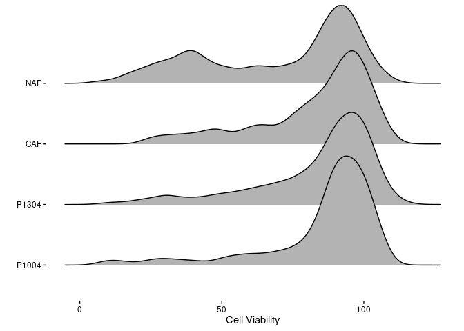
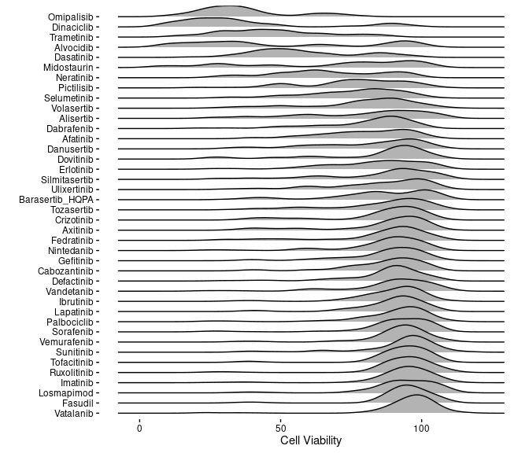
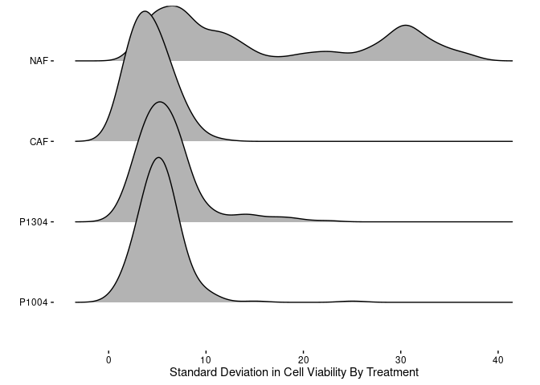
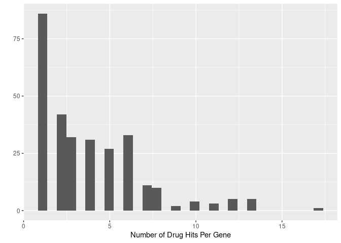
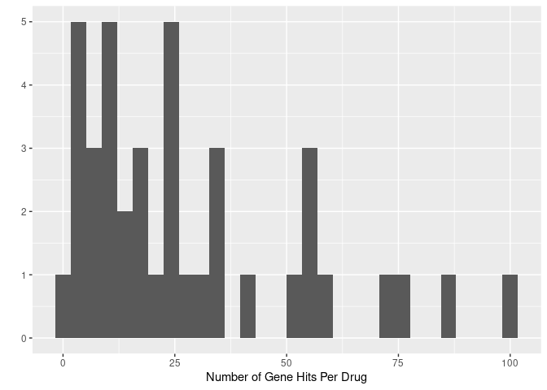
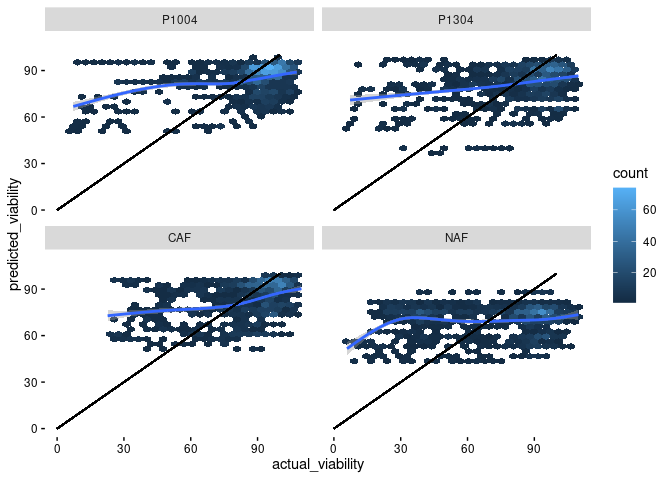
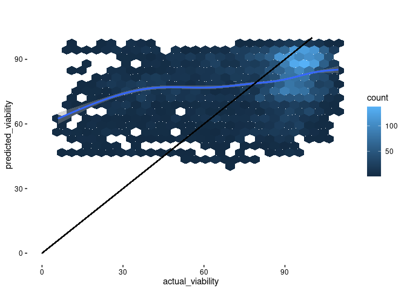
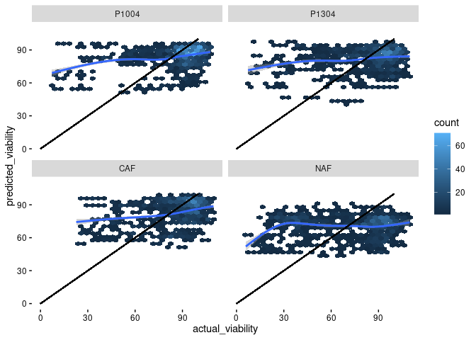
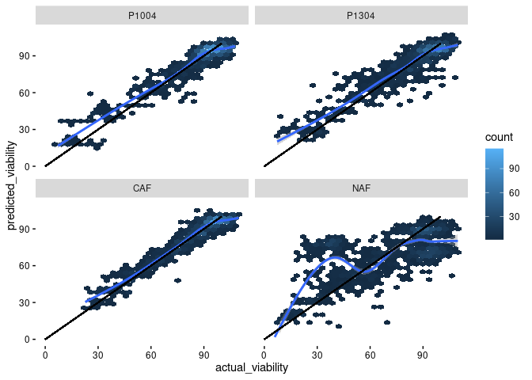

Build Klaeger PDAC Synergy Model - Random Forest
================
Matthew Berginski

# Read In and Combine Klaeger/Synergy Data

``` r
klaeger_data = read_rds(here('data/klaeger_full_tidy.rds'))

klaeger_data_wide = klaeger_data %>%
    pivot_wider(names_from = gene_name, values_from = relative_intensity)
```

``` r
synergy_data_only_single = read_rds(here('data/synergy_combined.rds')) %>%
    mutate(anchor_lower = tolower(anchor),
                 compound_lower = tolower(compound)) %>%
    filter(dose_anchor_m == 0 | dose_compound_m == 0)

compound_matches = read_csv(here('data/DrugMatches.csv')) %>%
    #removing one of the alisertib compound matches that aren't in my copy of the synergy
    filter(pdac != "mln8237")
```

    ## 
    ## ── Column specification ────────────────────────────────────────────────────────
    ## cols(
    ##   pdac = col_character(),
    ##   klaeger = col_character()
    ## )

``` r
klaeger_data_matches = klaeger_data_wide %>%
    #All of the Klaeger data with zero compound concentration are 1 across the
    #board, also I have no particular way to match up the the no-treatments with
    #all the no-treatments from the synergy screen.
    filter(concentration_M != 0) %>%
    mutate(drug_lower = tolower(drug)) %>%
    filter(drug_lower %in% compound_matches$klaeger) %>%
    left_join(compound_matches, by=c('drug_lower'='klaeger')) %>%
    select(drug,drug_lower,pdac,everything())

klaeger_data_matches_compound = klaeger_data_matches %>% 
    left_join(synergy_data_only_single %>% 
                            filter(dose_anchor_m == 0) %>%
                            select(compound_lower,dose_compound_m,viability,cell_line), 
                        by=c('pdac' = 'compound_lower', 'concentration_M' = 'dose_compound_m')) %>%
    select(drug,drug_lower,pdac,cell_line,viability,everything()) %>%
    filter(!is.na(viability))

klaeger_data_matches_anchor = klaeger_data_matches %>% 
    left_join(synergy_data_only_single %>% 
                            filter(dose_compound_m == 0) %>%
                            select(anchor_lower,dose_anchor_m,viability,cell_line), 
                        by=c('pdac' = 'anchor_lower', 'concentration_M' = 'dose_anchor_m')) %>%
    select(drug,drug_lower,pdac,cell_line,viability,everything()) %>%
    filter(!is.na(viability))

klaeger_data_matches_full = bind_rows(
    klaeger_data_matches_compound,
    klaeger_data_matches_anchor
) %>% select(drug,drug_lower,pdac,cell_line,viability,everything())

klaeger_data_matches_tidy = klaeger_data %>% 
    filter(drug %in% unique(klaeger_data_matches_full$drug), 
                 concentration_M %in% unique(klaeger_data_matches_full$concentration_M))

no_gene_variation = klaeger_data_matches_tidy %>%
    group_by(gene_name) %>%
    summarise(gene_sd = sd(relative_intensity)) %>%
    filter(gene_sd == 0)

klaeger_data_matches_full = klaeger_data_matches_full %>%
    select(-one_of(no_gene_variation$gene_name))
```

``` r
drug_viability_rank = klaeger_data_matches_full %>%
    group_by(drug) %>%
    summarise(mean_viability = mean(viability)) %>%
    arrange(desc(mean_viability))

cell_line_viability_rank = klaeger_data_matches_full %>%
    group_by(cell_line) %>%
    summarise(mean_viability = mean(viability)) %>%
    arrange(desc(mean_viability))

klaeger_data_matches_full = klaeger_data_matches_full %>%
    mutate(drug = fct_relevel(as.factor(drug), drug_viability_rank$drug),
                 cell_line = fct_relevel(as.factor(cell_line), cell_line_viability_rank$cell_line))
```

# Exploritory Data Analysis

## Cell Viability Visualizations

``` r
ggplot(klaeger_data_matches_full, aes(x = viability)) + 
    geom_histogram() +
    labs(x="Cell Viability", y="Number of Drug/Cell Line Combos") +
    BerginskiRMisc::theme_berginski()
```

    ## `stat_bin()` using `bins = 30`. Pick better value with `binwidth`.

<!-- -->

``` r
library(ggridges)
ggplot(klaeger_data_matches_full, aes(x=viability,y=cell_line)) +
    geom_density_ridges() +
    labs(x="Cell Viability",y='') +
    BerginskiRMisc::theme_berginski()
```

    ## Picking joint bandwidth of 3.71

<!-- -->

``` r
library(ggridges)
ggplot(klaeger_data_matches_full, aes(x=viability,y=drug)) +
    geom_density_ridges() +
    labs(x="Cell Viability",y='') +
    BerginskiRMisc::theme_berginski()
```

    ## Picking joint bandwidth of 4.47

<!-- -->

``` r
treatment_variability = klaeger_data_matches_full %>% 
    group_by(cell_line,drug,concentration_M) %>% 
    summarise(viability_sd = sd(viability),
                        viability_mean = mean(viability)) %>% 
    arrange(desc(viability_sd))
```

    ## `summarise()` has grouped output by 'cell_line', 'drug'. You can override using the `.groups` argument.

``` r
ggplot(treatment_variability, aes(x=viability_sd,y=cell_line)) +
    geom_density_ridges() +
    labs(x="Standard Deviation in Cell Viability By Treatment",y='') +
    BerginskiRMisc::theme_berginski()
```

    ## Picking joint bandwidth of 1.32

<!-- -->

## Kinase Inhibition Variation

There are 228 kinases that aren’t responsive to any of the compounds.
That leaves `length(unique(klaeger_data_matches_tidy$gene_name)) -
dim(no_gene_variation)[1]` responsive kinases. The number of compounds
they respond to is:

``` r
drug_hit_per_gene = klaeger_data_matches_tidy %>%
    filter(! gene_name %in% no_gene_variation$gene_name) %>%
    group_by(gene_name, drug) %>%
    summarise(gene_varies = any(relative_intensity != 1)) %>%
    group_by(gene_name) %>%
    summarise(number_drug_hits = sum(gene_varies))
```

    ## `summarise()` has grouped output by 'gene_name'. You can override using the `.groups` argument.

``` r
ggplot(drug_hit_per_gene, aes(x=number_drug_hits)) + 
    geom_histogram(bins=30) + 
    labs(x="Number of Drug Hits Per Gene",y='')
```

<!-- -->

``` r
drug_hit_per_gene = klaeger_data_matches_tidy %>%
    filter(! gene_name %in% no_gene_variation$gene_name) %>%
    group_by(gene_name, drug) %>%
    summarise(gene_varies = any(relative_intensity != 1)) %>%
    group_by(drug) %>%
    summarise(number_gene_hits = sum(gene_varies))
```

    ## `summarise()` has grouped output by 'gene_name'. You can override using the `.groups` argument.

``` r
ggplot(drug_hit_per_gene, aes(x=number_gene_hits)) + 
    geom_histogram(bins=30) + 
    labs(x="Number of Gene Hits Per Drug",y='')
```

<!-- -->

\#Modeling

## Random Forest - 10 fold random CV

``` r
tic()

metrics = data.frame()

for (this_cell_line in unique(klaeger_data_matches_full$cell_line)) {
    
    klaeger_matches_model_set = klaeger_data_matches_full %>%
        filter(cell_line == this_cell_line) %>%
        select(-drug,-drug_lower,-pdac,-concentration_M,-cell_line) 
    
    folds <- vfold_cv(klaeger_matches_model_set, v = 10)
    
    for (num_trees in seq(1000,5000,by=1000)) {
        
        rf_mod <-
            rand_forest(trees = num_trees) %>%
            set_engine("ranger", num.threads = 10) %>%
            set_mode("regression")
        
        rf_wf <-
            workflow() %>%
            add_model(rf_mod) %>%
            add_formula(viability ~ .)
        
        rf_fit_rs <-
            rf_wf %>%
            fit_resamples(folds, save_pred = T)
        
        metrics = rbind(
            metrics,
            collect_metrics(rf_fit_rs) %>% mutate(num_trees = num_trees, cell_line = this_cell_line)
        )
        
    }
}
toc()

# rf_fit = rf_mod %>%
#   fit(Growth ~ ., data = klaeger_data)
```

## Random Forest - Leave One Compound Out

``` r
tic()

prediction_results = c()
for (this_cell_line in unique(klaeger_data_matches_full$cell_line)) {
    
    klaeger_data_cell_line = klaeger_data_matches_full %>%
        filter(cell_line == this_cell_line)
    
    for (exclude_compound in unique(klaeger_data_cell_line$drug)) {
        
        klaeger_train = klaeger_data_cell_line %>%
            filter(drug != exclude_compound) %>%
            select(-drug,-drug_lower,-pdac,-concentration_M,-cell_line) 
        
        klaeger_test = klaeger_data_cell_line %>%
            filter(drug == exclude_compound) %>%
            select(-drug,-drug_lower,-pdac,-concentration_M,-cell_line)
        
        these_prediction_results = klaeger_data_cell_line %>%
            filter(drug == exclude_compound) %>%
            select(drug,drug_lower,pdac,concentration_M,cell_line)
        
        
        rf_mod <- 
            rand_forest(trees = 1000) %>% 
            set_engine("ranger", num.threads = 12) %>% 
            set_mode("regression")
        
        rf_fit_rs <-
            rf_mod %>%
            fit(viability ~ ., data = klaeger_train)
        
        these_prediction_results$predicted_viability = predict(rf_fit_rs,klaeger_test)$.pred
        these_prediction_results$actual_viability = klaeger_test$viability
        these_prediction_results$test_set_size = dim(klaeger_test)[1]
        
        prediction_results = bind_rows(
            prediction_results,
            these_prediction_results
        )
    }
}
toc()
```

    ## 110.472 sec elapsed

``` r
# prediction_results = prediction_results %>% 
#   left_join(klaeger_data_matches_full %>% 
#                           select(drug,drug_lower,pdac,concentration_M,cell_line,viability))

# rf_fit = rf_mod %>%
#   fit(Growth ~ ., data = klaeger_data)
```

``` r
ggplot(prediction_results, aes(x=actual_viability,y=predicted_viability)) +
    geom_hex() +
    # geom_point(alpha=0.05) +
    geom_smooth() +
    xlim(c(0,110)) + 
    ylim(c(0,110)) +
    geom_segment(aes(x=0,y=0,xend=100,yend=100)) +
    BerginskiRMisc::theme_berginski()
```

    ## Warning: Removed 26 rows containing non-finite values (stat_binhex).

    ## `geom_smooth()` using method = 'gam' and formula 'y ~ s(x, bs = "cs")'

    ## Warning: Removed 26 rows containing non-finite values (stat_smooth).

<!-- -->

``` r
ggplot(prediction_results, aes(x=actual_viability,y=predicted_viability)) +
    geom_hex() +
    # geom_point() +
    geom_smooth() +
    xlim(c(0,110)) + 
    ylim(c(0,110)) +
    geom_segment(aes(x=0,y=0,xend=100,yend=100)) +
    BerginskiRMisc::theme_berginski() +
    facet_wrap(~cell_line)
```

    ## Warning: Removed 26 rows containing non-finite values (stat_binhex).

    ## `geom_smooth()` using method = 'gam' and formula 'y ~ s(x, bs = "cs")'

    ## Warning: Removed 26 rows containing non-finite values (stat_smooth).

<!-- -->

## Random Forest - Leave One Compound/Concentration Out

``` r
tic()

if (file.exists(here('src/klaeger_synergy_model/predictions_LOO.rds'))) {
    prediction_results_LO_concen = read_rds(here('src/klaeger_synergy_model/predictions_LO_concen.rds'))
} else {
    prediction_results_LO_concen = c()
    for (this_cell_line in unique(klaeger_data_matches_full$cell_line)) {
        
        klaeger_data_cell_line = klaeger_data_matches_full %>%
            filter(cell_line == this_cell_line)
        
        for (exclude_compound in unique(klaeger_data_cell_line$drug)) {
            for (exclude_concentration in unique(klaeger_data_cell_line$concentration_M)) {
                
                klaeger_train = klaeger_data_cell_line %>%
                    filter(drug != exclude_compound, concentration_M != exclude_concentration) %>%
                    select(-drug,-drug_lower,-pdac,-concentration_M,-cell_line) 
                
                klaeger_test = klaeger_data_cell_line %>%
                    filter(drug == exclude_compound, concentration_M == exclude_concentration) %>%
                    select(-drug,-drug_lower,-pdac,-concentration_M,-cell_line)
                
                these_prediction_results = klaeger_data_cell_line %>%
                    filter(drug == exclude_compound, concentration_M == exclude_concentration) %>%
                    select(drug,drug_lower,pdac,concentration_M,cell_line)
                
                
                rf_mod <- 
                    rand_forest(trees = 1000) %>% 
                    set_engine("ranger", num.threads = 12) %>% 
                    set_mode("regression")
                
                rf_fit_rs <-
                    rf_mod %>%
                    fit(viability ~ ., data = klaeger_train)
                
                these_prediction_results$predicted_viability = predict(rf_fit_rs,klaeger_test)$.pred
                these_prediction_results$actual_viability = klaeger_test$viability
                these_prediction_results$test_set_size = dim(klaeger_test)[1]
                
                prediction_results_LO_concen = bind_rows(
                    prediction_results_LO_concen,
                    these_prediction_results
                )
            }
        }
        write_rds(prediction_results_LO_concen,here('src/klaeger_synergy_model/predictions_LO_concen.rds'))
    }
}
toc()
```

    ## 0.005 sec elapsed

``` r
ggplot(prediction_results_LO_concen, aes(x=actual_viability,y=predicted_viability)) +
    geom_hex() +
    # geom_point(alpha=0.05) +
    geom_smooth() +
    xlim(c(0,110)) + 
    ylim(c(0,110)) +
    geom_segment(aes(x=0,y=0,xend=100,yend=100)) +
    BerginskiRMisc::theme_berginski()
```

    ## Warning: Removed 26 rows containing non-finite values (stat_binhex).

    ## `geom_smooth()` using method = 'gam' and formula 'y ~ s(x, bs = "cs")'

    ## Warning: Removed 26 rows containing non-finite values (stat_smooth).

<!-- -->

``` r
ggplot(prediction_results_LO_concen, aes(x=actual_viability,y=predicted_viability)) +
    geom_hex() +
    # geom_point() +
    geom_smooth() +
    xlim(c(0,110)) + 
    ylim(c(0,110)) +
    geom_segment(aes(x=0,y=0,xend=100,yend=100)) +
    BerginskiRMisc::theme_berginski() +
    facet_wrap(~cell_line)
```

    ## Warning: Removed 26 rows containing non-finite values (stat_binhex).

    ## `geom_smooth()` using method = 'gam' and formula 'y ~ s(x, bs = "cs")'

    ## Warning: Removed 26 rows containing non-finite values (stat_smooth).

<!-- -->

## Random Forest - Leave One Out

``` r
tic()
if (file.exists(here('src/klaeger_synergy_model/predictions_LOO.rds'))) {
    prediction_results_LOO = read_rds(here('src/klaeger_synergy_model/predictions_LOO.rds'))
} else {
    prediction_results_LOO = c()
    for (this_cell_line in unique(klaeger_data_matches_full$cell_line)) {
        
        klaeger_data_cell_line = klaeger_data_matches_full %>%
            filter(cell_line == this_cell_line)
        
        for (exclude_row in 1:dim(klaeger_data_cell_line)) {
            
            klaeger_train = klaeger_data_cell_line[-exclude_row,] %>%
                select(-drug,-drug_lower,-pdac,-concentration_M,-cell_line) 
            
            klaeger_test = klaeger_data_cell_line[exclude_row,] %>%
                select(-drug,-drug_lower,-pdac,-concentration_M,-cell_line)
            
            these_prediction_results = klaeger_data_cell_line[exclude_row,] %>%
                select(drug,drug_lower,pdac,concentration_M,cell_line)
            
            rf_mod <- 
                rand_forest(trees = 1000) %>% 
                set_engine("ranger", num.threads = 10) %>% 
                set_mode("regression")
            
            rf_fit_rs <-
                rf_mod %>%
                fit(viability ~ ., data = klaeger_train)
            
            these_prediction_results$predicted_viability = predict(rf_fit_rs,klaeger_test)$.pred
            these_prediction_results$actual_viability = klaeger_test$viability
            
            prediction_results_LOO = bind_rows(
                prediction_results_LOO,
                these_prediction_results
            )
        }
    }
    write_rds(prediction_results_LOO,here('src/klaeger_synergy_model/predictions_LOO.rds'))
}
toc()
```

    ## 0.005 sec elapsed

``` r
ggplot(prediction_results_LOO, aes(x=actual_viability,y=predicted_viability)) +
    geom_hex() +
    # geom_point(alpha=0.05) +
    geom_smooth() +
    xlim(c(0,110)) + 
    ylim(c(0,110)) +
    geom_segment(aes(x=0,y=0,xend=100,yend=100)) +
    BerginskiRMisc::theme_berginski()
```

    ## Warning: Removed 26 rows containing non-finite values (stat_binhex).

    ## `geom_smooth()` using method = 'gam' and formula 'y ~ s(x, bs = "cs")'

    ## Warning: Removed 26 rows containing non-finite values (stat_smooth).

<!-- -->

``` r
ggplot(prediction_results_LOO, aes(x=actual_viability,y=predicted_viability)) +
    geom_hex() +
    # geom_point() +
    geom_smooth() +
    xlim(c(0,110)) + 
    ylim(c(0,110)) +
    geom_segment(aes(x=0,y=0,xend=100,yend=100)) +
    BerginskiRMisc::theme_berginski() +
    facet_wrap(~cell_line)
```

    ## Warning: Removed 26 rows containing non-finite values (stat_binhex).

    ## `geom_smooth()` using method = 'gam' and formula 'y ~ s(x, bs = "cs")'

    ## Warning: Removed 26 rows containing non-finite values (stat_smooth).

    ## Warning: Removed 1 rows containing missing values (geom_hex).

<!-- -->
