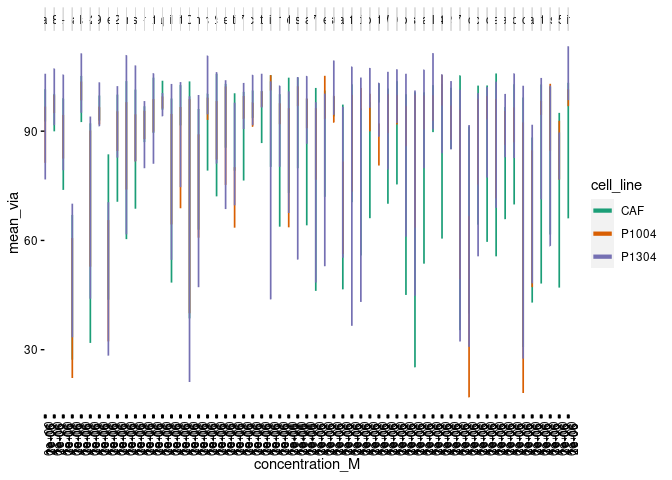

Klaeger EDA Figures
================
Matthew Berginski
2021-07-07

``` r
klaeger_screen_data = read_rds(here('results/klaeger_screen_for_regression.rds'))

cell_viability_summary = klaeger_screen_data %>%
    select(drug, concentration_M, viability, cell_line) %>%
    group_by(cell_line,concentration_M, drug) %>%
    summarise(mean_via = mean(viability))
```

    ## `summarise()` has grouped output by 'cell_line', 'concentration_M'. You can override using the `.groups` argument.

``` r
klaeger_screen_data_unique = klaeger_screen_data %>% select(-cell_line,-viability) %>% unique()

klaeger_screen_data_unique_tidy = klaeger_screen_data_unique %>%
    pivot_longer(-c(drug, concentration_M), names_to = "gene", values_to = "relative_intensity")

num_affected_kinases = klaeger_screen_data_unique_tidy %>%
    group_by(drug) %>%
    summarise(count = sum(relative_intensity != 1)) %>% 
    arrange(count)

num_kinase_hits = klaeger_screen_data_unique_tidy %>%
    group_by(gene) %>%
    summarise(count = sum(relative_intensity != 1)) %>% 
    arrange(desc(count)) %>%
    mutate(X = 1:length(count))

klaeger_screen_data_unique = klaeger_screen_data_unique %>% 
    mutate(drug = fct_relevel(as.factor(drug), num_affected_kinases$drug)) %>% 
    arrange(drug, concentration_M) %>%
    mutate(Y = 1:length(drug))

klaeger_screen_data_unique_tidy = klaeger_screen_data_unique_tidy %>%
    left_join(num_kinase_hits %>% select(gene, X)) %>%
    left_join(klaeger_screen_data_unique %>% select(drug, concentration_M,Y)) %>%
    mutate(relative_intensity = ifelse(relative_intensity > 2, 2, relative_intensity))
```

    ## Joining, by = "gene"

    ## Joining, by = c("drug", "concentration_M")

``` r
heat_labels = klaeger_screen_data_unique_tidy %>% group_by(drug) %>% summarise(mean_Y = mean(Y)) %>% mutate(X = -50, relative_intensity = 2)

klaeger_heat = ggplot(klaeger_screen_data_unique_tidy, aes(x=X,y=Y,fill=relative_intensity)) +
    geom_tile() + 
    theme_void() +
    scale_fill_gradient2(low = rgb(0.60,0.557,0.765,1), mid = rgb(1,1,1,1), high = rgb(0.946,0.639,0.251,1), midpoint = 1)
    # scale_fill_distiller(type = "div")

ggsave(here('figures/klaeger_EDA/klaeger_heat.png'),height=40, limitsize = F)
```

    ## Saving 7 x 40 in image

``` r
BerginskiRMisc::trimImage(here('figures/klaeger_EDA/klaeger_heat.png'))

klaeger_heat_label = klaeger_heat + 
    geom_text(data = heat_labels, mapping = aes(x = X,y = mean_Y,label = drug)) +
    xlim(c(-65,NA))

ggsave(here('figures/klaeger_EDA/klaeger_heat_reg_size.png'),height=12) 
```

    ## Saving 7 x 12 in image

``` r
BerginskiRMisc::trimImage(here('figures/klaeger_EDA/klaeger_heat_reg_size.png'))
```

``` r
cell_viability_summary = cell_viability_summary %>%
    mutate(drug = fct_relevel(as.factor(drug), num_affected_kinases$drug))

ggplot(cell_viability_summary, aes(x=concentration_M,y=mean_via, color=cell_line)) +
    geom_line(lwd=1.5) + 
    BerginskiRMisc::theme_berginski() +
    theme(axis.text.x = element_text(angle = 90)) +
    scale_color_brewer(type = "qual", palette = "Dark2") +
    facet_wrap(~drug,nrow=1)
```

<!-- -->

``` r
ggsave(here('figures/klaeger_EDA/via_curves.png'), width=40,height=2, dpi=300, limitsize = F)
```
