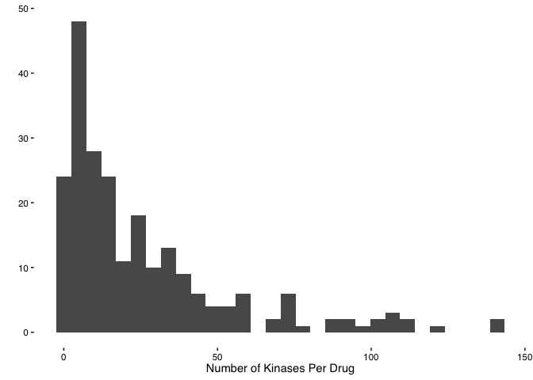
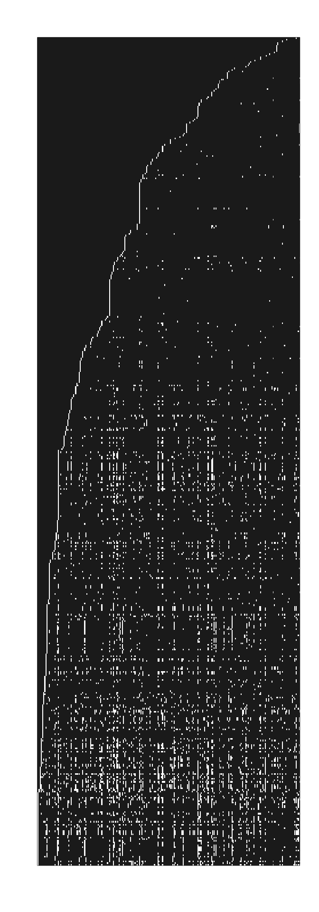

Process and Organize Klaeger Data
================
Matthew Berginski

I downloaded a copy of supplemental table 2 from the Klaeger et
al. paper from 2017 (DOI: 10.1126/science.aan4368). This data file
contains the combinations of compound and kinase that the study counted
as a hit. I think this partially because the number of kinases listed
for each compound varies widely, also the page 4 of the supplement
implies it. Also, this is how I would design the supplement to make it
easier for a biologist/chemist interested a given compound to go see
what else is marked a hit.

What do we do about the all the compounds missing from the data table
then? Since they aren’t a hit by the fitting method Klaeger describes,
that means that the relative abundance of the kinase isn’t affected by
the compound. Thus, we should set all these “missing” values to 1 which
indicates that the relative ratio with DMSO stays the same throughout.

I have tried to double check that non-hits are excluded with compound
Y−39983. Klaeger has also provided a set of PDF files with summaries
of each hit and non-hit
(<https://www.proteomicsdb.org/#projects/4257/6090>, for Y-39983). For Y
compound, there are 36 plots in the hits section of the PDF, matching
the number in the supplemental table. Small victory.

This method of checking sucks though and what I really want is every
relative call for every kinase in all the conditions, but mass spec
analysis is a nightmare. Save me future grad student.

``` r
klaeger_raw = read_excel(here('data/KlaegerScience2017/Klaeger_Science_2017 Supplementary Table 2 Target Lists.xlsx'), sheet=3) %>% 
    clean_names() %>% 
    select(drug,gene_name,contains('relative')) %>%
    mutate(relative_intensity_30_n_m = as.numeric(relative_intensity_30_n_m)) %>%
    mutate(relative_intensity_1000_n_m = as.numeric(relative_intensity_1000_n_m)) %>%
    pivot_longer(-c(drug,gene_name), 
                             names_to = "concentration_str", 
                             values_to = "relative_intensity") %>%
    mutate(concentration_M = case_when(
        concentration_str == "relative_intensity_dmso" ~ 0,
        concentration_str == "relative_intensity_3_n_m" ~ 3e-9,
        concentration_str == "relative_intensity_10_n_m" ~ 10e-9,
        concentration_str == "relative_intensity_30_n_m" ~ 30e-9,
        concentration_str == "relative_intensity_100_n_m" ~ 100e-9,
        concentration_str == "relative_intensity_300_n_m" ~ 300e-9,
        concentration_str == "relative_intensity_1000_n_m" ~ 1000e-9,
        concentration_str == "relative_intensity_3000_n_m" ~ 3000e-9,
        concentration_str == "relative_intensity_30000_n_m" ~ 30000e-9,
        TRUE ~ NA_real_
    )) %>%
    select(-concentration_str)

#Now to built a data set that contains all the values that aren't included
#because the kinase intensity doesn't vary
missing_combos = crossing(drug = unique(klaeger_raw$drug),
                                                    gene_name = unique(klaeger_raw$gene_name),
                                                    concentration_M = unique(klaeger_raw$concentration_M)) %>%
    setdiff(klaeger_raw %>% select(drug,gene_name,concentration_M)) %>%
    mutate(relative_intensity = 1)

klaeger_full = bind_rows(klaeger_raw, missing_combos)

# This code takes a while to run, but can be used to check if there are only one combo between drug, gene and concentration
# row_counts = klaeger_full %>% count(drug,gene_name,concentration_M)
# all(row_counts$n == 1)
```

There are a few NA entries (198) in the data file, which appear to be
complete drug concentrations that are missing from the data file.
Missing data makes the downstream modeling angry, so I’ll find all those
missing values and simply interpolate the missing values as the average
of the two closest concentrations.

``` r
NA_entries = klaeger_full %>% filter(is.na(relative_intensity))

interpolated_NA_relative_intensity = c()

for (i in 1:dim(NA_entries)[1]) {
    close_entries = klaeger_raw %>% 
        filter(drug == NA_entries$drug[i],gene_name == NA_entries$gene_name[i]) %>% 
        mutate(concen_diff = abs(concentration_M - NA_entries$concentration_M[i])) %>% 
        arrange(concen_diff)
    
    interpolated_NA_relative_intensity = c(interpolated_NA_relative_intensity,mean(close_entries$relative_intensity[2:3]))
}

NA_entries$relative_intensity = interpolated_NA_relative_intensity

klaeger_full = bind_rows(klaeger_full,
                                                 NA_entries) %>%
    filter(!is.na(relative_intensity))
```

OK, now to deal with some of the crazy outliers in the data set. There
are relative intensity values of up to around 25, indicating that
addition of a given compound is causing a kinase to show up 25X from the
DMSO treatment. This seems…unlikely and probably due to some sort of
problem the with processing or analysis. So I’m going to knock any value
above the 99.99th percentile down to that value.

``` r
max_val = quantile(klaeger_full$relative_intensity, 0.9999, na.rm=T)
klaeger_full = klaeger_full %>%
    mutate(relative_intensity = ifelse(relative_intensity >= max_val, max_val, relative_intensity)) %>%
    write_rds(here('data/klaeger_full_tidy.rds'))
```

# Exploritory Data Analysis

``` r
included_drug_gene_combos = klaeger_raw %>% 
    select(drug, gene_name) %>% 
    unique()

missing_drug_genes_combos = crossing(drug = unique(klaeger_raw$drug),
                                                                         gene_name = unique(klaeger_raw$gene_name)) %>%
    setdiff(included_drug_gene_combos)

percent_present  = signif(100*dim(included_drug_gene_combos)[1]/(dim(included_drug_gene_combos)[1] + dim(missing_drug_genes_combos)[1]),3)
```

Considering all the possible drug/gene target combinations in the
Klaeger data, only 4.97% are present in the data set. The distribution
of the number of listed gene hits per compound is:

``` r
klaeger_counts = klaeger_raw %>% 
    group_by(drug) %>% 
    summarise(num_kinases = length(unique(gene_name))) %>%
    arrange(num_kinases)

ggplot(klaeger_counts, aes(x=num_kinases)) + 
    geom_histogram() +
    labs(x="Number of Kinases Per Drug",y='') +
    BerginskiRMisc::theme_berginski()
```

    ## `stat_bin()` using `bins = 30`. Pick better value with `binwidth`.

<!-- -->

``` r
for_heatmap = klaeger_full %>%
    mutate(relative_intensity = ifelse(relative_intensity == 1, 1, 0)) %>%
    # filter(drug == "Abemaciclib") %>%
    pivot_wider(names_from = gene_name, values_from = relative_intensity) %>% 
    mutate(drug_concen = paste0(drug,concentration_M)) %>% 
    select(-drug,-concentration_M) %>% 
    column_to_rownames(var = "drug_concen")

image(as.matrix(for_heatmap),xlab='',xaxt='n',yaxt='n',col=c("#FFFFFF","#222222"))
```

<!-- -->
