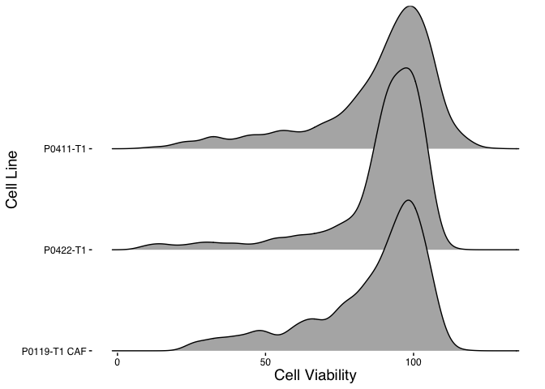

Build EDA Figures
================
Matthew Berginski
2021-07-07

# Read In Combined Klaeger/Synergy Data and Organize

This chunk of code reads in the pre-processed Klaeger/Synergy data.

``` r
klaeger_data_matches_full = read_rds(here('results/klaeger_screen_for_regression.rds'))
```

``` r
drug_viability_rank = klaeger_data_matches_full %>%
    group_by(drug) %>%
    summarise(mean_viability = mean(viability)) %>%
    arrange(desc(mean_viability))

cell_line_viability_rank = klaeger_data_matches_full %>%
    group_by(cell_line) %>%
    summarise(mean_viability = mean(viability)) %>%
    arrange(desc(mean_viability))

klaeger_data_matches_full = klaeger_data_matches_full %>%
    mutate(drug = fct_relevel(as.factor(drug), drug_viability_rank$drug),
                 cell_line = fct_relevel(as.factor(cell_line), cell_line_viability_rank$cell_line))
```

# Exploritory Data Analysis

## Cell Viability Visualizations

``` r
ggplot(klaeger_data_matches_full, aes(x = viability)) + 
    geom_histogram() +
    labs(x="Cell Viability", y="Number of Drug/Cell Line Combos") +
    theme_berginski()
```

    ## `stat_bin()` using `bins = 30`. Pick better value with `binwidth`.

<!-- -->

``` r
library(ggridges)
ggplot(klaeger_data_matches_full, aes(x=viability,y=cell_line)) +
    geom_density_ridges() +
    # scale_x_continuous(expand = c(0, 0)) +
    scale_y_discrete(expand = expand_scale(mult = c(0.01, .7))) +
    labs(x="Cell Viability",y='Cell Line') +
    # theme_ridges() +
    theme_berginski()
```

    ## Warning: `expand_scale()` is deprecated; use `expansion()` instead.

    ## Picking joint bandwidth of 3.23

<!-- -->

``` r
dir.create(here('figures/EDA_plots'), recursive = T, showWarnings = F)
ggsave(here('figures/EDA_plots/cell_line_viability_plots.png'),height = 6.5, width = 4)
```

    ## Picking joint bandwidth of 3.23

``` r
trimImage(here('figures/EDA_plots/cell_line_viability_plots.png'))
```

``` r
library(ggridges)
ggplot(klaeger_data_matches_full, aes(x=viability,y=drug)) +
    geom_density_ridges() +
    labs(x="Cell Viability",y='Compound') +
    # scale_y_discrete(expand = expand_scale(mult = c(0.01, .7))) +
    theme_berginski()
```

    ## Picking joint bandwidth of 4.73

<!-- -->

``` r
ggsave(here('figures/EDA_plots/compound_viability_plots.png'),height = 6.5)
```

    ## Saving 7 x 6.5 in image
    ## Picking joint bandwidth of 4.73

``` r
trimImage(here('figures/EDA_plots/compound_viability_plots.png'))
```

``` r
treatment_variability = klaeger_data_matches_full %>% 
    group_by(cell_line,drug,concentration_M) %>% 
    summarise(viability_sd = sd(viability),
                        viability_mean = mean(viability)) %>% 
    arrange(desc(viability_sd))
```

    ## `summarise()` has grouped output by 'cell_line', 'drug'. You can override using the `.groups` argument.

``` r
ggplot(treatment_variability, aes(x=viability_sd,y=cell_line)) +
    geom_density_ridges() +
    labs(x="Standard Deviation in Cell Viability By Treatment",y='') +
    theme_berginski()
```

    ## Picking joint bandwidth of 0.726

<!-- -->
