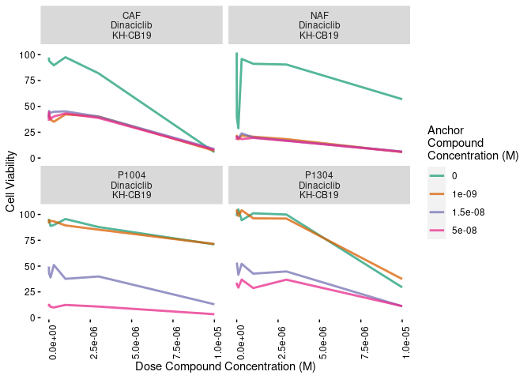
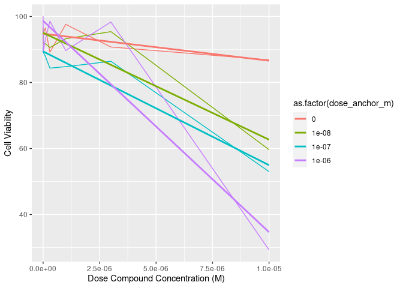
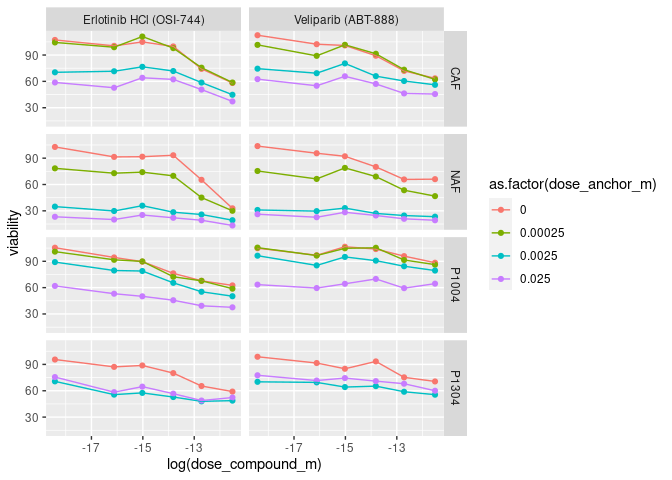

Process Synergy
================
Matthew Berginski
11/10/2020

``` r
synergy_files = list.files(here('data','SynergyData'), full.names = T)

synergy_data = data.frame()

col_types = cols(
    Ind = col_character(),
    Anchor = col_character(),
    Compound = col_character(),
    `DoseAnchor(M)` = col_double(),
    `DoseCompound(M)` = col_double(),
    plate = col_double(),
    row = col_double(),
    col = col_double(),
    Viability = col_double()
)

for (this_file in synergy_files) {
    cell_line = case_when(
        str_detect(this_file,"CAF") ~ "CAF",
        str_detect(this_file,"NAF") ~ "NAF",
        str_detect(this_file,"P1004") ~ "P1004",
        str_detect(this_file,"P1304") ~ "P1304",
        TRUE ~ "No_Line"
    )
    
    if (cell_line == "No_Line") {
        next;
    }
    
    synergy_data = rbind(synergy_data,
                                             read_delim(this_file, delim=";", col_types = col_types) %>%
                                                mutate(cell_line = cell_line))
}


synergy_data = synergy_data %>% 
    clean_names() %>%
    #there were downstream problems with the NAF line used in the screen, removing
    #from data set
    #Maybe it isn't a problem? Conversation with Shawn 2-10-2021
    # filter(cell_line != "NAF") %>%
    # select(-ind,-plate,-row,-col) %>%
    write_rds(here('data/synergy_combined.rds'))
```

``` r
DMSO_synergy = synergy_data %>% 
    filter(compound == "DMSO") %>% 
    group_by(anchor,dose_anchor_m,cell_line) %>% 
    summarise(viability = mean(viability)) %>%
    mutate(dose_compound_m = 0)
```

    ## `summarise()` has grouped output by 'anchor', 'dose_anchor_m'. You can override using the `.groups` argument.

``` r
compound_anchor_combos = synergy_data %>% 
    filter(compound != "DMSO") %>% 
    select(anchor,compound) %>%
    unique()

DMSO_synergy = DMSO_synergy %>%
    inner_join(compound_anchor_combos)
```

    ## Joining, by = "anchor"

``` r
model_synergy <- function(data_set) {
    return(tidy(lm(viability ~ dose_anchor_m + dose_compound_m + dose_anchor_m:dose_compound_m, data = data_set)))
}

get_interaction_p_value <- function(data_set) {
    return(tail(data_set$p.value,n=1))
}

get_interaction_coef <- function(data_set) {
    return(tail(data_set$estimate,n=1))
}

synergy_data_nested = synergy_data %>%
    filter(compound != "DMSO") %>%
    add_row(DMSO_synergy) %>%
    group_by(anchor, compound, cell_line) %>% 
    nest() %>%
    mutate(model_results = map(data,model_synergy)) %>%
    mutate(interaction_coef = map_dbl(model_results,get_interaction_coef)) %>%
    mutate(interaction_p_value = map_dbl(model_results,get_interaction_p_value)) %>%
    mutate(interaction_p_value_adj = p.adjust(interaction_p_value, method = 'BH')) %>%
    mutate(trimmed_compound = trimws(str_extract(compound,"[^(]*"))) %>%
    mutate(plot_title = paste0(cell_line,'\n',anchor,'\n',trimmed_compound)) %>%
    arrange(interaction_p_value_adj)
```

``` r
synergy_filtered = synergy_data_nested %>%
    filter(interaction_p_value_adj <= 0.05, interaction_coef < 0)

synergy_filtered_pos = synergy_data_nested %>%
    filter(interaction_p_value_adj <= 0.05, interaction_coef > 0) %>%
    arrange(desc(interaction_coef))

fraction_diff_coef = synergy_data_nested %>% 
    group_by(anchor,compound) %>% 
    summarise(percent_over_zero = mean(interaction_coef > 0),
                        average_coef = mean(interaction_coef),
                        coef_abs_sum = sum(abs(interaction_coef))) %>% 
    filter(percent_over_zero > 0 & percent_over_zero < 1) %>%
    arrange(coef_abs_sum)
```

    ## `summarise()` has grouped output by 'anchor'. You can override using the `.groups` argument.

``` r
for (this_anchor in unique(synergy_filtered$anchor)) {
    # for (this_anchor in c("I-BET151")) {
    this_synergy_set = synergy_filtered %>%
        filter(anchor == this_anchor) %>%
        arrange(interaction_coef)
    
    all_synergy_filtered_data = data.frame()
    for (i in 1:dim(this_synergy_set)[1]) {
        all_synergy_filtered_data = rbind(all_synergy_filtered_data,
                                                                            this_synergy_set[[4]][[i]] %>%
                                                                                mutate(plot_title = this_synergy_set$plot_title[i]))
        
    }
    all_synergy_filtered_data$plot_title = fct_relevel(as.factor(all_synergy_filtered_data$plot_title), 
                                                                                                         this_synergy_set$plot_title)
    
    ggplot(all_synergy_filtered_data, aes(x=dose_compound_m, y=viability, color=as.factor(dose_anchor_m))) + 
        geom_line(size=1,alpha=0.75) +
        # geom_smooth(method="lm", se=F,alpha = 0.1) +
        labs(x="Dose Compound Concentration (M)",y="Cell Viability", color="Anchor\nCompound\nConcentration (M)") +
        BerginskiRMisc::theme_berginski() +
        theme(axis.text.x = element_text(angle = 90)) +
        scale_color_brewer(type = "qual", palette = "Dark2") +
        facet_wrap(vars(plot_title))
    
    plot_size = sqrt(length(unique(this_synergy_set$compound))*5)
    
    ggsave(here('figures','synergy',paste0(this_anchor,'.png')), width = plot_size,height = plot_size)
}
```

``` r
for (this_anchor in unique(synergy_filtered_pos$anchor)) {
    # for (this_anchor in c("I-BET151")) {
    this_synergy_set = synergy_filtered_pos %>%
        filter(anchor == this_anchor) %>%
        arrange(interaction_coef)
    
    all_synergy_filtered_data = data.frame()
    for (i in 1:dim(this_synergy_set)[1]) {
        all_synergy_filtered_data = rbind(all_synergy_filtered_data,
                                                                            this_synergy_set[[4]][[i]] %>%
                                                                                mutate(plot_title = this_synergy_set$plot_title[i]))
        
    }
    all_synergy_filtered_data$plot_title = fct_relevel(as.factor(all_synergy_filtered_data$plot_title), 
                                                                                                         this_synergy_set$plot_title)
    
    ggplot(all_synergy_filtered_data, aes(x=dose_compound_m, y=viability, color=as.factor(dose_anchor_m))) + 
        geom_line(size=1,alpha=0.75) +
        # geom_smooth(method="lm", se=F,alpha = 0.1) +
        labs(x="Dose Compound Concentration (M)",y="Cell Viability", color="Anchor\nCompound\nConcentration (M)") +
        BerginskiRMisc::theme_berginski() +
        theme(axis.text.x = element_text(angle = 90)) +
        scale_color_brewer(type = "qual", palette = "Dark2") +
        facet_wrap(vars(plot_title))
    
    plot_size = sqrt(length(unique(this_synergy_set$compound))*5)
    
    ggsave(here('figures','non_synergy',paste0(this_anchor,'.png')), width = plot_size,height = plot_size)
}
```

``` r
this_synergy_set = synergy_data_nested %>%
    filter(anchor == "Dinaciclib", trimmed_compound == "KH-CB19")
all_synergy_filtered_data = data.frame()
for (i in 1:dim(this_synergy_set)[1]) {
    all_synergy_filtered_data = rbind(all_synergy_filtered_data,
                                                                        this_synergy_set[[4]][[i]] %>%
                                                                            mutate(plot_title = this_synergy_set$plot_title[i]))
    
}

ggplot(all_synergy_filtered_data, aes(x=dose_compound_m, y=viability, color=as.factor(dose_anchor_m))) + 
    geom_line(size=1,alpha=0.75) +
    # geom_smooth(method="lm", se=F,alpha = 0.1) +
    labs(x="Dose Compound Concentration (M)",y="Cell Viability", color="Anchor\nCompound\nConcentration (M)") +
    BerginskiRMisc::theme_berginski() +
    theme(axis.text.x = element_text(angle = 90)) +
    scale_color_brewer(type = "qual", palette = "Dark2") +
    facet_wrap(vars(plot_title))
```

<!-- -->

``` r
ggplot(synergy_filtered[[4]][[4]], aes(x=dose_compound_m, y=viability, color=as.factor(dose_anchor_m))) + 
    geom_line() +
    geom_smooth(method="lm", se=F) +
    labs(x="Dose Compound Concentration (M)",y="Cell Viability")
```

    ## `geom_smooth()` using formula 'y ~ x'

<!-- -->

``` r
BerginskiRMisc::theme_berginski()
```

    ## List of 8
    ##  $ axis.title.x    :List of 11
    ##   ..$ family       : NULL
    ##   ..$ face         : NULL
    ##   ..$ colour       : NULL
    ##   ..$ size         : NULL
    ##   ..$ hjust        : NULL
    ##   ..$ vjust        : NULL
    ##   ..$ angle        : NULL
    ##   ..$ lineheight   : NULL
    ##   ..$ margin       : 'margin' num [1:4] 1.5points 0points 0points 0points
    ##   .. ..- attr(*, "unit")= int 8
    ##   ..$ debug        : NULL
    ##   ..$ inherit.blank: logi FALSE
    ##   ..- attr(*, "class")= chr [1:2] "element_text" "element"
    ##  $ axis.title.y    :List of 11
    ##   ..$ family       : NULL
    ##   ..$ face         : NULL
    ##   ..$ colour       : NULL
    ##   ..$ size         : NULL
    ##   ..$ hjust        : NULL
    ##   ..$ vjust        : NULL
    ##   ..$ angle        : NULL
    ##   ..$ lineheight   : NULL
    ##   ..$ margin       : 'margin' num [1:4] 0points 1.5points 0points 0points
    ##   .. ..- attr(*, "unit")= int 8
    ##   ..$ debug        : NULL
    ##   ..$ inherit.blank: logi FALSE
    ##   ..- attr(*, "class")= chr [1:2] "element_text" "element"
    ##  $ axis.text       :List of 11
    ##   ..$ family       : NULL
    ##   ..$ face         : NULL
    ##   ..$ colour       : chr "black"
    ##   ..$ size         : NULL
    ##   ..$ hjust        : NULL
    ##   ..$ vjust        : NULL
    ##   ..$ angle        : NULL
    ##   ..$ lineheight   : NULL
    ##   ..$ margin       : NULL
    ##   ..$ debug        : NULL
    ##   ..$ inherit.blank: logi FALSE
    ##   ..- attr(*, "class")= chr [1:2] "element_text" "element"
    ##  $ axis.ticks      :List of 6
    ##   ..$ colour       : chr "black"
    ##   ..$ size         : NULL
    ##   ..$ linetype     : NULL
    ##   ..$ lineend      : NULL
    ##   ..$ arrow        : logi FALSE
    ##   ..$ inherit.blank: logi FALSE
    ##   ..- attr(*, "class")= chr [1:2] "element_line" "element"
    ##  $ panel.background: list()
    ##   ..- attr(*, "class")= chr [1:2] "element_blank" "element"
    ##  $ panel.grid      : list()
    ##   ..- attr(*, "class")= chr [1:2] "element_blank" "element"
    ##  $ panel.grid.major: list()
    ##   ..- attr(*, "class")= chr [1:2] "element_blank" "element"
    ##  $ panel.grid.minor: list()
    ##   ..- attr(*, "class")= chr [1:2] "element_blank" "element"
    ##  - attr(*, "class")= chr [1:2] "theme" "gg"
    ##  - attr(*, "complete")= logi FALSE
    ##  - attr(*, "validate")= logi TRUE

``` r
ggplot(synergy_data %>% filter(anchor == "Abraxane", 
                                                             compound == "Veliparib (ABT-888)" | compound == "Erlotinib HCl (OSI-744)"), 
             aes(x=log(dose_compound_m),y=viability,color=as.factor(dose_anchor_m))) + 
    geom_point() + 
    geom_line() +
    facet_grid(cell_line ~ compound)
```

<!-- -->

``` r
# temp_synergy = rbind(synergy_data_nested[[3]][[1]],
#                                        synergy_data_nested[[3]][[2]] %>% group_by())
# 
# ggplot(temp_synergy, aes(x=dose_compound_m,y=viability,color=as.factor(dose_anchor_m))) + 
#   geom_point() + 
#   geom_line() +
#   facet_wrap(~cell_line)
```
